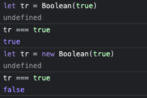
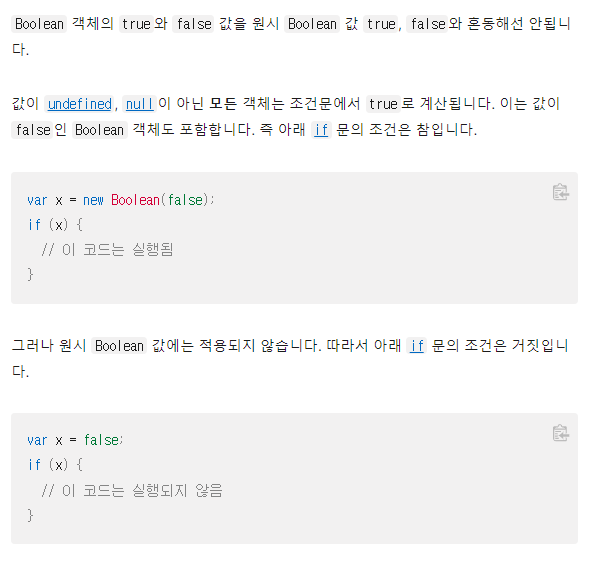
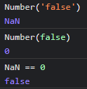
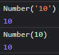

# bool

    boolean 타입에 해당하는 값은 true와 false 두가지가 있다.
    이 값들을 '진리값'이라고 부르며, 프로그래밍에서 진리값은
    어떤 조건이 참인지 거짓인지를 나타내기 위해 사용된다.

## 1. Boolean

    Boolean객체는 불리언 값을 감싸고 있는 객체이며, 첫번째 매개변수로서
    전달한 값은 필요한 경우 불리언 값으로 변환된다.

```js
let one = true; // 다른 언어는 True와 같이 T가 대문자인 경우도 있음.
let two = false;
let three;
let four = null;
let five = Infinity; // 비교에서 활용

console.log(Boolean('')); // false
console.log(Boolean(' ')); // true
console.log(Boolean('abc')); // true
console.log(Boolean(0)); // false
console.log(Boolean(100)); // true
console.log(Boolean(-100)); // true
console.log(Boolean(three)); // false
console.log(Boolean(four)); // false
console.log(Boolean(five)); // true
one = '';
one = ' ';
```

    -Boolean 객체를 사용해 위와 같이 true또는 false를 반환 할 수 있다.

    -또한 비어있는 문자열은 false이며 공백이 있는 문자열은 true이다.

    -0을 제외한 모든 숫자는 true이다. (음수포함)

    -변수에 값을 할당하지 않은 상태 또한 false

    -null도 false

    -Infinity는 true로 출력되며, -를 붙여도 마찬가지.

    -그러나 여기서 주의할 점은 new키워드로 만든 객체와 원시값은 다르다는 것이다.



    위의 그림을 참고하자.



    위는 mdn에서 가져온 문서이다.

## 1-2. 우리를 힘들게 하는 JS..

```js
console.log(Boolean([])); // true >> 다른 언어에서는 비어있는 array는 false가 출력됨.
console.log(Boolean({}));
```

    위의 예제에서 Boolean에 빈 array를 넣으면 true가 출력되는 것을 볼 수 있다.

    이는 빈 object도 마찬가지이다.

    원래 다른언어에서는 비어있는 array는 false로 출력되지만
    js에서는 왜인지 true가 출력됨.

# 비교연산자

    비교 연산자는 피연산자를 서로 비교하고, 비교 결과가 참인지에 따라
    논리 값을 반환한다.

```js
const one = 10;
const two = 3;
const one_ = '10';

console.log(one > two); // true
console.log(one >= two); // true
console.log(one < two); // false
console.log(one <= two);
console.log(one == two);
console.log(one != two); //
console.log(one === two); // 다른 언어에는 없음.
console.log(one !== two); // 다르다

// 우리를 힘들게 하는 JS
console.log('-----------------');
console.log(one == one_); // true (너무 관대해서 true를 출력) 다른언어에서는 이와 같은 경우 false를 출력
console.log(one === one_); // JS에서의 === 은 다른언어에서의 ==
// 견고한 코딩을 위해 ===을 권장.
```

    - >=, <= 는 왼쪽 피연산자가 오른쪽 피연산자와 같거나 작으면
    true를 반환한다.

    - != 는 피연산자가 서로 다르면 true를 반환.

    - 위의 경우에서 one != one_ 을 하면 false가 나오는데 피연산자가 서로 같기때문이다.

    - !== 는 피연산자의 값 또는 타입이 서로 다를경우 true를 반환.

    - one !== one_ 이 true인 이유는 값은 같으나 타입이 다르기 때문에 true를 반환.

    - == 는 피연산자가 서로 같으면 true를 반환  따라서 one_ == one 은 true.

    - === 는 두 피연산자의 값과 타입이 모두 같은 경우 true를 반환.

-   참고 : 견고한 코딩을 위해 ===을 권장한다.  
     js에서 ===은 다른 언어에서 ==과 같다.

# 논리연산자

    논리연산자는 보통 불리언(논리) 값과 함께 사용해서 불리언 값을 반환한다.
    그러나 &&와 || 연산자는 사실 두 피연산자 중 하나를 반환하는 것으로,
    만약 둘 중 하나가 불리언 값이 아니라면 논리 연산자의 반환 값도 불리언 값이 아닐 수 있음.

    불리언 값이 아닌 예 ) 회원가입성공여부 = username || '이름을 입력하지 않으신 분';

    위와 같은 경우 피연산자가 불리언 값이 아니라서 앞이나 뒤의 값을 반환한다.

---

    true : 1
    false : 0
    and(&&) : 곱
    or(||) : 합
    not(!) : 부정

## 1. 논리연산 예제

```JS
console.log(true || false); // true
console.log(true || true); // true
console.log(true && false); // false
console.log(!false); // true
console.log(!!false); // 실무에서도 정말 많이 사용함. !!는 true false가 직접적으로 들어갈 경우 사용
//즉, boolean이 아닌 데이터를 boolean으로 표현하고 싶을 때 사용
```

    위의 예제로 보았을 때 알수 있는 점

    1. || 은 둘 중 하나만 true 또는 둘 다 true면 true를 반환. (둘다 false면 false를 반환)

    2. && 은 둘 중 하나만 false여도 false를 반환. (둘다 true여야 true를 반환)

        2-1. &&연산자는 모든 값이 true인지를 체크를 해야해서 맨 끝까지 체크가 들어가고
        결과적으로 제일 마지막에 체크한 끝값을 리턴한다.
        또한 도중에 false값을 확인하면 더 이상 체크할 필요를 느끼지 못해 체크를 멈추고
        false 값을 리턴한다

        2-2. 정리 : 양쪽 모두 true인지 체크 한 후 앞의 값이 false이면 뒤는 뭐가 오던
        결과가 false가 되기 때문에 체크할 필요가 없어서 앞의 값을 리턴한다.

    3. ! 은 부정이며 !false는 true를 반환한다.

    4. !! 는 true false가 직접적으로 들어갈 경우 사용함.
    즉, boolean이 아닌 데이터를 boolean으로 표현하고 싶을 때 사용.

    >> 앞선 불리언 값이 아닌 예에서 논리 연산의 반환값을 true나 false로 해주기 위해 !!를 사용함.

        4-1. 예제 ) console.log(!!'') >> 아무것도 없는 문자열을 boolean으로 표현해주기 위해 !!을 사용

## 1-2. 논리연산 헷갈리는 예제

```js
console.log('confuse_1');
console.log('false' == false); // false
console.log(!'false'); // false
console.log(!'0'); // false
console.log('abc' / 1); // NaN
console.log(!!NaN); // false
console.log(!!null); // false
console.log(!!undefined); //false
```

    1. 위의 예제에서 'false' == false 가 false인 이유는



    위와 같은 일이 일어나고 있는 것이기 떄문이다. 즉, 숫자로 바꿔서 비교하기 때문이다.
    그렇기 때문에 0 == false 는 true이다.

    헷갈리는 예로 '10' == 10 이 true인 이유는



    위와 같은 과정이 일어나기 때문이다.

    2. !'false' 가 false인 이유는 'false' 는 문자열로 true이기 때문에 ! 부정을 통해 false로 변환.

        2-1. !'0' 도 똑같은 이유

    3. 'abc' / 1 >> 문자열을 숫자로 나누면 NaN이 출력됨.

---

    4. 앞서 공부한 내용에 따르면 ==은 숫자로 바꾸어 비교한다고 했는데 null을 Number화 하면 0이 나온다.

    그렇다면 공부한 내용에 따라 false == null 또한 true가 나와야 될 것이다

    왜냐면 false또한 0이고 null 또한 0이기 때문이다.

    그러나 정확히 null은 Number로 형변환을 하면 0이 나오지만 false가 아니다

    즉, false는 아니지만 falsy한 성질을 띄기 때문에 false로 출력이 되는 것이다.

    정리하자면 null, NaN, undefined는 각각 아예 없는것, Number, 정의 되지 않음 으로 분류되지

    boolean은 아니다 하지만 위의 세가지 타입을 boolean화 했을 땐 false가 된다.

    즉, 정확히 false는 아니나 falsy한 성질을 띈다 라고 이해하면 된다.

    부정의 속성을 가졌지만 부정 그자체는 아니다!

# 단락평가

    단락평가는 간단한 코드에서 권고하며 예제와 같은 프로세스이지 동일한 코드를 사용하는 것은 아님.

```js
username = '';
username = username || '이름을 입력하지 않으신 분';
console.log(username);

username = 'abc';
username = username || '이름을 입력하지 않으신 분';
console.log(username);
```

    1. 위의 예제에서 첫번째 예제는 username에 아무것도 입력하지 않았다. 따라서 username은 false가 되고

    username = false || '이름을 입력하지 않으신 분' 이 된다. 그 후 '이름을 입력하지 않으신 분'이

    true이기 때문에 username = false || true 가 되어 최종적으로 '이름을 입력하지 않으신 분'이

    출력이 된다.

    2. 두번째 예시는 username에 'abc' 로 문자열이 들어가 username은 true가 된다.

    따라서 username = true || '이름을 입력하지 않으신 분' 인 상태가 되므로

    최종적으로 abc 를 출력한다.

        2-1. 참고 )      username = "";
                        username = username || false || 'test';
                        console.log(username);

                        위의 경우엔 최종적으로 test를 출력함. 즉, 앞의 모든 값이 false이므로
                        true를 찾아 출력 만약 모두 false라면 false를 출력

        2-2. 정리 : 앞의 값이 true면 뒤의 값은 확인하지 않고 앞의 값을 출력
        앞의 값이 false이면 뒤의 값을 출력하는데 도중에 true를 만나면 true인 값을 출력하고
        뒤의 값은 확인하지 않음.

## 단락평가 문제

```js
username = '';
pw = '';
회원가입성공여부 = username || '이름을 입력하지 않으신 분';
console.log(username);
```

    위의 문제에서 username도 입력하고 pw도 입력해야만 회원가입성공여부가
    true, false로 나오게 하려면 어떻게 해야할까?

    우선 username과 pw모두 입력을 해야하므로

    회원가입성공여부 = username && pw 가 된다 그 뒤 true또는 false로 반환을 해주기 위해

    username && pw 를 !!(username && pw)로 처리해준다.

    위에서 !!를 사용한 이유는 불리언이 아닌 데이터를 불리언으로 표현해주기 위해서이다.

    최종적으로 회원가입성공여부 = !!(username && pw) 로 해주면 username과 pw가 모두 입력되어야

    true가 되고 둘 중 하나라도 입력하지 않으면 false가 되므로 우리가 원하는 질문의 해답을 찾을 수 있다.

## 혼동을 일으키는 여러가지 사례들

    NaN === NaN // false 가 출력이 되는데 NaN은 자기자신이 자기자신이 아닌? 특이 케이스이다.

```js
console.log(false == null);
console.log(false == NaN);
console.log(false == undefined);
```

    위의 예제는 null, NaN, undefined가 boolean으로 형변환을 하면 false가 맞지만,

    앞서 공부한 내용에 따라 falsy한 성질을 띄는 것이므로 false가 출력되는 것임.

    즉, false와 위의 삼형제들은 논리적으로 같지않음.

---

    +false 는 0으로 출력이 되는데 +의 경우 암묵적 형변환이라 불리며 숫자로 형변환이 된다.

    그러나 +의 경우 암묵적 형변환이라 의도를 파악하기 어려워 사용을 피하는게 좋다.

---

    js에서는 console.log('2' - '2') 를 계산하면 0이 출력된다

    그 이유는 -를 보는순간 수학적 연산을 하려고 하는구나 하고 Number로 형변환을 하기 때문.
