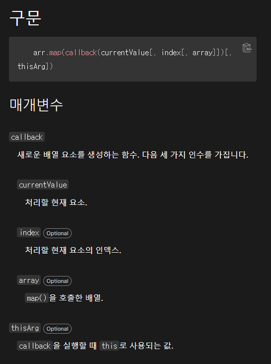
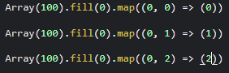
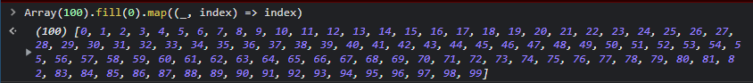

# map

    오늘 배열에 대한 복습을 할 때 map이 나왔을 때 나름 공부를 했다고 생각했는데
    막상 사용하는 것을 보니 굉장한 어려움을 겪었습니다..ㅠㅠ

    그래서 팀원들과 함께 map에 대해 공부한 것을 정리해보려 합니다!

```js
let x20 = Array(100)
    .fill(0)
    .map((_, index) => index)
    .join('');
```

    오늘 이해가 안됐던 코드입니다.
    남들이 보기엔 쉬워보일지 몰라도 저희는 약 40분동안 끙끙 앓아가며 문제를 해결했습니다!!

    우선 첫번째 저희가 겪었던 문제는 위의 코드에서 _ >> 언더바 이녀석의 역할이
    도대체 무엇이냐

    그리고 두번째 저기 index라고 적힌 부분에는 어떤 값이 들어가길래
    0부터 99까지 출력을 해주냐 분명히 index에는 +연산자가 없는데 이해가 안된다!

    라는 문제점이었습니다.

## map에 대한 자료 찾아보기

    이를 해결해주기 위해서 mdn에 있는 map을 참고했습니다



    위에 있는 구문과 매개변수를 참고하여 언더바의 역할을 짐작해보았는데,

    우선 언더바는 currentValue라고 판단을 하였고 매개변수 설명에 따르면
    처리할 현재 요소. 를 가르키고 있습니다.

    여기서 요소란 배열안의 각각의 아이템을 말합니다.

    또한 map이란 녀석은 모든 요소들을 한 번씩 순회하며
    어떠한 동작을 한 후 결과들을 모아 새로운 배열에 담아 반환하는 것입니다.

## currentValue와 index

    따라서 currentValue에 들어가는 처리해야 할 현재요소라는 것은
    이해가 안됐던 코드에 있는 0으로 가득채워진 각각의 요소들이라는 것을 알게되었습니다.

    즉, 저 언더바의 역할은 그저 처리해야 할 현재요소를 담는 통이라고 생각을 했고
    그렇기 때문에 아무런 의미가없는 언더바로 이름을 지어준 것이었습니다!!

    처리해야 할 요소를 담는 통이기 때문에 Number나 String으로 currentValue값을
    적어주면 신택스 에러가 출력이 되는 것이었습니다.

    또한 index는 위의 매개변수를 참고했을 때 처리할 현재 요소의 인덱스
    즉, index 번호를 가르키는 것이었습니다!

    그래서 이를 과정으로 다시 살펴보면



    위의 예제처럼 우선 처리해야할 요소들이 저희는 전부 0이기 때문에 우선
    언더바의 자리에 0이 들어갑니다.

    그 후에 index자리에 첫 번째 인덱스 번호인 0이 들어가게 되고,
    그 옆의 index에도 0이 들어가게 됩니다.

    그렇게 첫 번째 해야 할 일을 마무리 한 뒤 다음 일을 수행합니다.

    그다음 역시 우리가 처리해야할 요소는 0이라 언더바의 자리에 0이들어갑니다.
    그 후에 그다음 인덱스 번호인 1이 들어가게 되고 그 옆의 index에도 1이 들어갑니다.

    이와 같은 과정을 계속해서 반복하여 0부터 99까지 순차적으로 index번호를 출력합니다.



    위와 같은 결과를 반환하게 됩니다.

    여기서 또 생긴 궁금증이 있었습니다. (이 궁금증이 생겼을 땐 map이 새로운 배열을 반환하는 건지 인지하지 못하고 있었음.)

    그렇다면 처리해야 할 현재 요소들이 전부 1이라고 가정한다면

    똑같은 코드를 작성하였을 때 1이 붙어서 나오지않을까??
    >> 아닙니다! 왜와이? map은 새로운 배열을 반환하기 때문에!

    이렇게 팀원들과 제가 궁금했던 모든부분들을 해결할 수 있었고 map에 대한 이해도가

    한층 올라간 것 같아 기분이 너무 좋았습니다.

    오늘은 꿀잠자야쥥 ㅋ
