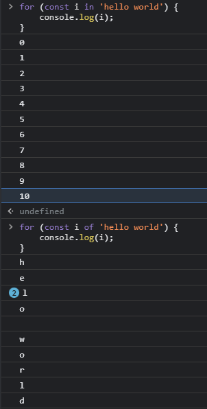

# 반복문

    JavaScript에는 여러가지 반복문이 있다.
    주로 어떤 것을 반복적으로 시행할 때 빠르고 간편하게 사용이 가능하다.

    JS의 반복문에는

    for, for in, for of, while, do while 이 있다.

    이외에도 반복문을 빠져나오거나 다시 시작할 때 사용되는 break, continue
    도있다.

## 1. for문

    대표적인 반복문이며 for문은 설정한 조건이 거짓이 될 때까지 반복한다.

```js
for (초기문; 조건문; 증감문) {
    //code block;
}
```

    위와 같이 사용하며 조건이 거짓이 될 때까지 실행문을 반복한다.

    또한 for문의 구성요소들은 ㅁ두 선택적으로 사용할 수 있다.
    즉, 초기문,조건문,증감문을 적어주는 것이 필수는 아니라는 소리다.

    그러나 모든 구성요소를 생략할 경우 무한루프에 빠지게되므로 조심!
    >> break문을 이용해 빠져나올 수 있음.

    for문 구성요소 선택적 사용시 주의사항

    1. 세미콜론은 생략불가.
    2. 모든 구성요소 생략시 세미콜론은 반드시 포함되어야 함.

## 1-1. 초기문, 조건문, 증감문

```js
for (let i = 0; i < 5; i++) {
    console.log(i);
}
```

    1. 초기문은 code block이 실행되기 전에 한 번 실행된다.
    보통은 반복문에서 카운팅 역할을 하는 변수를 선언 또는 초기화 하는 역할을 한다.

    2. 조건문에서는 조건이 참인지 거짓인지를 판별한다.
    만약 참이라면 code block을 실행하고, 거짓이면 for문을 종료한다.

    3. 증감문이 있다면 code block 실행 이후에 증감문을 실행한다.
    그리고 다시 조건문을 판별하는 단계로 돌아간다.

    4. 위 예시에서는 i의 값이 5가 되는 순간 i < 5가 거짓이 되기 때문에
    i가 0~4일 때까지 실행되고 for문이 종결된다.

## 4. for in

    for in 반복문은 배열 요소를 하나하나 꺼내서 특정 문장을 실행할 때 사용

```js
for (const 반복 변수 in 배열 또는 객체){
    문장
}
```

    위와 같은 형태가 기본 형태이며 반복 변수에는 요소의 인덱스들이 들어감.

    object에서 for in을 사용시 반복 변수에는 key를 불러오고 object[반복 변수]
    를 입력해주면 value를 불러온다.


    배열에서의 for in 과 오브젝트에서의 for in 은 위와 같이 출력된다.

## 5. for of

    for of 반복문은 요소의 값을 반복할 때 안정적으로 사용할 수 있다.

```js
for (const 반복 변수 of 배열 또는 객체){
    문장
}
```

    기본형태는 위와 같으며 for in과 다르게 반복 변수에 요소의 값이 들어간다.



    위의 예제가 for in과 for of의 차이점이다

    앞서 말했듯 반복 변수에 요소의 값이 들어가는 것을 확인할 수 있다.

    이를 활용하여

```js
let newMyArr = myArr.fill(0).map((_, index) => index + 1);

let s = 0;
for (let i of newMyArr) {
    s += i;
}
```

    위와 같이 for of문을 사용하여 1부터 100까지 더하는 예제를 만들어보았습니다.

```js
let s = 0;
for (let i in newMyArr) {
    s += newMyArr[i];
}
```

    for in을 사용하면 위와같이 사용하여 1부터 100까지 더해줄 수 있습니다.

## 6. for문 연습

```js
let s = 1;
for (let i = 1; i <= 100; i++) {
    s = s * i;
}
```

    위의 예제에서 1부터 100까지의 곱을 구해주었습니다.

    합에서와는 다르게 s를 1이라고 해 준 이유는 초깃값이 합과 같이 0이라면
    처음에 곱해질때 0과 곱해지므로 계속해서 0이 출력됨.

## 6-1. for문 과 배열의 조합

    for문을 배열과 조합하여 사용할 수 있는데 보통 배열의 length 속성만큼
    반복을 돌리는 형태로 사용한다.

```js
let data1 = ['a', 'b', 'c', 'd', 'e'];
for (let i = 0; i < data1.length; i++) {
    console.log(data1[i]);
}
```

    위의 예제를 보면 data1.length만큼 for문을 실행해주고 있는데 data1.length는
    5이므로 결국 i < 5의 조건을 만족할 때까지 실행하는 것이다.

    또한 data1[i] 인것은 data1의 인덱스를 차례차례 호출하는 것이므로 예를들어
    i = 0일 때 data1[0] 이 되므로 0번째 인덱스인 'a' 를 출력한다.

## 7. while 반복문

    while 반복문은 if 조건문과 형태가 매우 비슷함.
    다른 점은 문장을 한 번만 실행하고 끝내는 것이 아니라 불 표현식이
    true면 계속해서 문장을 실행한다는 것이다.
    즉, 무한루프에 빠질 수 있음.

```js
while(불 표현식) {
    문장
}
```

    위의 형태가 기본형태이다.

    js에서는 무한 반복을 사용하면 페이지 전체가 먹통이 되는 문제가 발생하므로
    break구문 등을 활용하여 반드시 무한 반복을 벗어나도록 코드를 구현해야 한다.

    while반복문은 횟수를 기준으로 반복하는 것 보다는
    조건에 큰 비중이 있을 때 사용하는 것이 좋다.

    예를들면 특정 시간동안 어떤 데이터를 받을 때까지, 배열에서 어떠한 요소가
    완전히 제거될 때까지 등 조건을 기반으로 사용하는 반복문에 while을 사용한다.

## 8. break 키워드

    break 키워드는 반복문을 벗어날 때 사용하는 키워드이다.
    while 반복문은 조건이 참인 동안 계속해서 진행되므로 이러한 무한루프는
    break 키워드를 사용하면 벗어날 수 있다.

```js
for (let i = 0; true; i++) {
    alert(`${i}번째 반복입니다`);

    const isContinue = confirm('계속 반복하시겠습니까?');
    if (isContinue === false) {
        console.log(`${i}번 반복된 후 종료되었습니다.`);
        break;
    }
}
```

    위의 예제를 통해 break를 만나면 종료되는 것을 알 수 있다.

## 간단한 최종정리

    1. for in 반복문은 배열의 인덱스를 기반으로 반복할 떄 사용

    2. for of 반복문은 배열의 값을 기반으로 반복할 때 사용

    3. for 반복문은 횟수를 기반으로 반복할 때 사용

    4. while 반복문은 조건을 기반으로 반복할 때 사용(단, 무한루프에 빠지지않도록 주의)

    5. break 키워드는 switch조건문이나 반복문을 벗어날 때 사용
