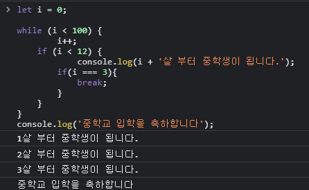

# 반복문

    JavaScript에는 여러가지 반복문이 있다.
    주로 어떤 것을 반복적으로 시행할 때 빠르고 간편하게 사용이 가능하다.

    JS의 반복문에는

    for, for in, for of, while, do while 이 있다.

    이외에도 반복문을 빠져나오거나 다시 시작할 때 사용되는 break, continue
    도있다.

## 1. for문

    대표적인 반복문이며 for문은 설정한 조건이 거짓이 될 때까지 반복한다.

```js
for (초기문; 조건문; 증감문) {
    //code block;
}
```

    위와 같이 사용하며 조건이 거짓이 될 때까지 실행문을 반복한다.

    또한 for문의 구성요소들은 ㅁ두 선택적으로 사용할 수 있다.
    즉, 초기문,조건문,증감문을 적어주는 것이 필수는 아니라는 소리다.

    그러나 모든 구성요소를 생략할 경우 무한루프에 빠지게되므로 조심!
    >> break문을 이용해 빠져나올 수 있음.

    for문 구성요소 선택적 사용시 주의사항

    1. 세미콜론은 생략불가.
    2. 모든 구성요소 생략시 세미콜론은 반드시 포함되어야 함.

## 1-1. 초기문, 조건문, 증감문

```js
for (let i = 0; i < 5; i++) {
    console.log(i);
}
```

    1. 초기문은 code block이 실행되기 전에 한 번 실행된다.
    보통은 반복문에서 카운팅 역할을 하는 변수를 선언 또는 초기화 하는 역할을 한다.

    2. 조건문에서는 조건이 참인지 거짓인지를 판별한다.
    만약 참이라면 code block을 실행하고, 거짓이면 for문을 종료한다.

    3. 증감문이 있다면 code block 실행 이후에 증감문을 실행한다.
    그리고 다시 조건문을 판별하는 단계로 돌아간다.

    4. 위 예시에서는 i의 값이 5가 되는 순간 i < 5가 거짓이 되기 때문에
    i가 0~4일 때까지 실행되고 for문이 종결된다.

## 2. while 문

    while문은 조건문이 true일 경우 코드가 실행되며, 조건문이 false가 되면 종료되는 반복문이다.
    조건문이 true인 경우 계속해서 실행됨.

```js
while ([조건문]) {
    //code block
}

//ex
let i = 1;
while (i <= 10) {
    console.log('Number: ' + i);
    i++;
}
```

    while문은 for문에서의 증감문이 code block안에 있다.
    i의 값을 위의 예제와같이 i++처럼 바꾸어주지 않으면 항상 10보다 작거나 같다는 조건을 만족하기 때문에
    무한루프가 발생한다.

## 3. break

    반복문이 조건에 따라 종료되기 전에 종료를 할 수 있는데 break를 사용하여 종료가 가능하다.



    위와 같이 break를 임의로 넣어주었는데 break는 해당 조건을 만나 break되면 즉시 반복문을 종료한다.
