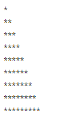
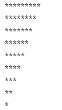

# 별찍기 첫번째 예제

```js
for (let i = 0; i < 9; i++) {
    for (let j = 0; j <= i; j++) {
        document.write('*');
    }
    document.write('<br>');
}
```



    위의 코드를 실행하면 위와 같은 모양의 피라미드가 출력된다.

    이 과정을 적어보고자 합니다.

## 어떤 과정을 거치는가??

```js
for (let i = 0; i < 9; i++) {
    for (let j = 0; 0 <= 0; j++) {
        document.write('*');
    }
    document.write('<br>');
}

for (let i = 0; i < 9; i++) {
    for (let j = 0; 1 <= 0; j++) {
        document.write('*');
    }
    document.write('<br>');
}

for (let i = 0; i < 9; i++) {
    for (let j = 0; 0 <= 1; j++) {
        document.write('*');
    }
    document.write('<br>');
}

for (let i = 0; i < 9; i++) {
    for (let j = 0; 1 <= 1; j++) {
        document.write('*');
    }
    document.write('<br>');
}

for (let i = 0; i < 9; i++) {
    for (let j = 0; 2 <= 1; j++) {
        document.write('*');
    }
    document.write('<br>');
}
```

    먼저 i = 0부터 시작을 하여 for문 으로 들어갑니다.

    그 후 중첩되어 있는 for문을 만나 i 의 값이 0이 되어 위와 같이 i의 자리에 0이 들어갑니다.

    또한 중첩되어 있는 for문의 j또한 0부터 시작하므로 둘의 비교는 위의 예제처럼
    0 <= 0 이되어 true값이 됩니다 따라서 현재 문서에 *을 찍어줍니다.

    그 후 아직 j가 포함된 for문이 종료되지 않았음으로 j의 값에 1을 더해줍니다
    그 다음 j의 값은 1이 되어 1 <= 0 을 비교합니다.

    1 <= 0 은 false이므로 j가 포함된 for문을 탈출합니다.

    그후 문서의 br태그를 만나 줄바꿈을 한 뒤 아직 처음 for문이 종료되지 않았음으로
    i 의 값에 1을 더하여 i는 1이됩니다.

    그 후 i는 1이된 상태로 다시 j가 포함된 for문의 i자리에 1로 들어갑니다.

    그 후 j가 포함된 for문이 다시 실행되어 0부터 다시 시작합니다.

    그렇게 위와 같은 과정을 계속해서 반복하여 피라미드 모형이 출력이 됩니다.

# 별찍기 두번째 예제

```js
for (let i = 0; i < 9; i++) {
    for (let j = 9; j > i; j--) {
        document.write('*');
    }
    document.write('<br>');
}

for (let i = 0; i < 9; i++) {
    for (let j = 9; 9 > 0; j--) {
        document.write('*');
    }
    document.write('<br>');
}

for (let i = 0; i < 9; i++) {
    for (let j = 9; 8 > 0; j--) {
        document.write('*');
    }
    document.write('<br>');
}
//.......................계속해서 진행

for (let i = 0; i < 9; i++) {
    for (let j = 9; 0 > 0; j--) {
        document.write('*');
    }
    document.write('<br>');
}
```



    이번에는 위와같은 코드로 역삼각형을 출력해주었습니다.

    차이점이 있다면 j는 9부터 시작하고 j ++ 이 아닌 j -- 를 통해
    j의 값을 1씩 마이너스 해주고있습니다.

    위 예제의 코드 진행은 위와 같은 프로세스로 진행이 됩니다

    9부터 시작하여 1씩 빼주고 있으므로 마지막 0 > 0이 될때까지

    문서에 *을 찍어줌으로 총 9개의 별이 찍힙니다.
    그런 다음 0 > 0은 false이므로 j를 포함한 반복문을 탈출해
    줄바꿈을 한 뒤 기존의 삼각형과 같은 프로세스를 거치게 됩니다.
