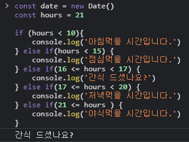

# 조건문

    조건문은 프로그램의 흐름을 변경할 때 사용한다.
    js에서 가장 일반적인 조건문은 if문이며 쉬우면서도 많이 사용하는 구문이니
    여러가지 예제를 다뤄보는게 좋다

## 1. 조건문에 대해

    조건문을 사용하면 조건에 따라 코드를 실행 (true) 할 수도 있고
    실행하지 않을 (false) 수도 있다.

    이처럼 코드가 실행되는 흐름을 변경하는 것을 "조건분기" 라고 한다.

## 2. if 조건문

    if (불 값이 나오는 표현식) {
        불 값이 참일 때 실행할 문장
    }

    불 표현식의 값이 true면 중괄호 안의 문장을 실행하고 false면 무시한다.

    불 값이 true일 때 실행되는 문장이 1줄이면 중괄호를 생략가능.

## 2-1. if 조건문 간단한 예제

```js
const date = new Date();
const hours = date.getHours();

if (hours < 12) {
    console.log('오전입니다.');
}

if (hours > 12) {
    console.log('오후입니다.');
}
```

    위와 같이 간단한 예제를 만들어 주었다
    hours 즉, 시간이 12시 이후이면 오후입니다. 를 콘솔창에 출력하고
    시간이 12시 이전이라면 오전입니다. 를 콘솔창에 출력한다.

## 3. if else 조건문

    if (불 값이 나오는 표현식) {
        불 값이 참일 때 실행할 문장
    } else {
        불 값이 거짓일 때 실행할 문장
    }

    위와 같은 조건문을 if else 조건문이라 부르며 else 구문은 if조건문 바로 뒤에
    붙여서 사용한다.

## 3-1. if else 조건문 예제

    앞서 다룬 예제를 if else조건문을 활용하여 사용을 해보자

```js
const date = new Date();
const hours = date.getHours();

if (hours < 12) {
    // 표현식 hours < 12 일 때 실행함.
    console.log('오전입니다.');
    // 표현식 hours < 12 가 거짓일 때 실행함.
} else {
    console.log('오후입니다.');
}
```

    위와 같이 if else 구문을 사용하여 if 조건문을 2번 사용하지 않아도 된다는 장점이있다.
    또한 if 조건문의 조건 하나를 처리하는 횟수가 줄어 실제 성능 향상에 조금이나마 도움이 됨.

## 4. 중첩 조건문

    조건문 안에 조건문을 중첩하는 것을 중첩 조건문이라 한다.
    또한 여러번 중첩이 가능하다.

```js
if (불 값이 나오는 표현식1) {
    if (불 값이 나오는 표현식2) {
        표현식 2가 참일 때 실행할 문장
    } else {
        표현식 2가 거짓일 때 실행할 문장
    }
} else {
    if (불 값이 나오는 표현식3) {
        표현식 3이 참일 때 실행할 문장
    } else {
        표현식 3이 거짓일 때 실행할 문장
    }
}
```

    위와 같이 하나의 if조건문에 다른 if조건문을 중첩할 수 있다.

## 4-1. 중첩 조건문 간단한 예제

```js
const date = new Date();
const hours = 9;

if (hours < 10) {
    console.log('아침먹을 시간입니다.');
} else {
    if (hours < 15) {
        console.log('점심먹을 시간입니다.');
    } else {
        console.log('저녁먹을 시간입니다.');
    }
}
```

    위와 같이 중첩 조건문을 활용하여 앞서 만든 예제를 아침,점심,저녁으로 나누어
    출력하게 만들어 줄 수 있다.

```js
undefined;
const date = new Date();
const hours = 21;

if (hours < 10) {
    console.log('아침먹을 시간입니다.');
} else {
    if (hours < 15) {
        console.log('점심먹을 시간입니다.');
    } else {
        if (hours < 17) {
            console.log('간식 드셨나요?');
        } else {
            if (hours < 20) {
                console.log('저녁먹을 시간입니다.');
            } else {
                console.log('야식먹을 시간입니다.');
            }
        }
    }
}
```

    위와 같이 계속해서 중첩도 가능하다.

## 5. if else if 조건문

    중첩 조건문에서 중괄호를 생략한 형태가 if else if 조건문이다.
    즉, 겹치치 않는 3가지 이상의 조건으로 나눌 때 사용함.

```js
if(불 표현식){
    문장
} else if (불 표현식){
    문장
} else if(불 표현식){
    문장
}
```

    위와 같은 구조를 가지고 있음.

```js
const date = new Date();
const hours = 20;

if (hours < 10) {
    console.log('아침먹을 시간입니다.');
} else if (11 <= hours && hours <= 15) {
    console.log('점심먹을 시간입니다.');
} else if (16 <= hours && hours < 17) {
    console.log('간식 드셨나요?');
} else if (17 <= hours && hours <= 20) {
    console.log('저녁먹을 시간입니다.');
} else if (21 <= hours && hours <= 23>) {
    console.log('야식먹을 시간입니다.');
} else {
    console.log('이제 잘 시간입니다.')
}
```

    위와 같이 논리연산자와 if else if 조건문을 활용하여 우리가 적었던 예제를
    바꿔줄 수 있다.

## 6. 핵심 포인트

    1. if 조건문은 조건에 따라 코드를 실행하거나 실행하지 않도록 하기위해 사용하는 구문이다.

    2. else 구문은 if조건문 뒤에 사용하며, if 조건문이 거짓일 때 사용한다.

    3. 중첩 조건문은 조건문을 중첩해서 사용하는 경우를 의미한다.

    4. if else if 조건문은 중첩 조건문에서 중괄호를 생략한 형태로,
    겹치지 않는 3가지 이상의 조건으로 나눌 때 사용한다.

## 7. 헷갈렸던 부분



    위의 예제를 콘솔창에 출력 해보면 "간식 드셨나요?"가 출력됩니다.

    제가 의도한 바는 hours가 16보다 크거나 같고 17보다 작을때만을 위해
    예제와 같이 작성을 해주었는데

    알고보니 16 <= hours < 17은 16 <= hours || hours < 17 과 같은 것이었습니다.

    즉, 예제에서 보이는 hours 는 현재 21인 상황인데 '간식 드셨나요?' 가 출력되는 이유가
    16 <= hours < 17 는 || 과 같이 작동하므로 hours가 16보다 큰 것이 true가 되어
    뒤의 17보다 작음은 확인하지 않고 바로 '간식 드셨나요?' 가 출력되는 것이었습니다.

    이를 해결해주기 위해 16 <= hours && hours < 17 이렇게 적어주었습니다.

## 7-1. 헷갈렸던 부분 2

```js
const a = parseInt(prompt('숫자를 입력해주세요'));
if (a === NaN) {
    alert('숫자를 입력해주세요');
} else if (a === 0) {
    alert('0입니다');
} else if (a > 0) {
    alert('양수입니다.');
} else {
    alert('음수입니다.');
}
```

    위의 예제에서 알림창에 숫자를 입력하지 않으면 '숫자를 입력해주세요'
    를 출력하고 싶었습니다.

    그러기 위해 parseInt(prompt('숫자를 입력해주세요')) 에 문자를 입력하였을 때
    NaN임을 console.log로 찍어 확인을 하였고 예제와 같이 코드작성을 해주었습니다.

    그러나 제가 원하는 바와는 다르게 계속 '음수입니다.' 가 출력 되었습니다.

    이 또한 알고보니 변수 a가 NaN이라 할지라도 if조건문에서와 같이 NaN과 비교하면
    false가 출력되는 것이었습니다.

    확인을 위해 콘솔 창에서 NaN === NaN을 비교해주었고 false가 출력 되는 것을 확인했습니다.

    즉, 굳이 비교하자면 무한대 === 무한대 또한 true가 아니듯이 NaN도 똑같다는 것입니다.

    이를 해결해주고자 isNaN()을 사용하여 NaN이 맞냐 아니냐를 판단해주었고
    코드를

```js
const a = parseInt(prompt('숫자를 입력해주세요'));
if (isNaN(a)) {
    alert('숫자를 입력해주세요');
} else if (a === 0) {
    alert('0입니다');
} else if (a > 0) {
    alert('양수입니다.');
} else {
    alert('음수입니다.');
}
```

    위와 같이 고쳐주니 제대로 작동했습니다.

    찾아보니 NaN === NaN 이 false 인것은 JavaScript 언어 설계의 오류라고 합니다.. 허허
