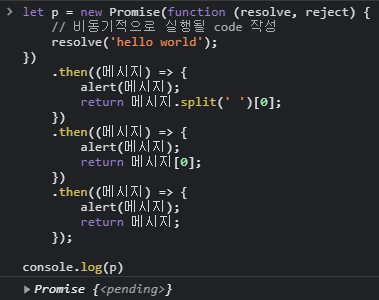
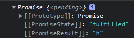
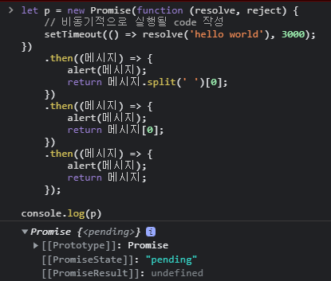

# truthy와 falsy

    truthy는 true같지만 정확히 true는 아닌 것 falsy는 false같지만 정확히 false는 아닌 것 이라고
    볼 수 있다.

    truthy한 값과 falsy한 값 모두 true또는 false로 변환되기 때문에 if문의 조건에 사용할 수 있다.

# NaN

    NaN은 'not a number' 숫자가 아님. 을 의미한다

    NaN은 NaN === NaN => false가 출력이 되는데 이걸 표현하자면,
    '숫자가 아님'은 '숫자가 아님'과 동일한가? 를 묻는 말이다.

    또한 JS는 내부적으로 비교 x === y(여기서 x와 y는 값)는 true 또는 false를 생성한다.
    이러한 비교는 다음과 같이 수행이 되는데,

    1. x 가 NaN이면 false를 반환합니다.
    2. y 가 NaN이면 false를 반환합니다.

    위와 같은 순서로 작업이 수행된다.

## 1. Number.isNaN()

    위의 문법은 ES6에서 추가도입 된 문법인데 암기하도록 하자.

    isNaN은 오해의 소지가 많기 때문에 위의 문법을 사용하는 것이 좋다.

```js
/*
// https://www.designcise.com/web/tutorial/what-is-the-difference-between-isnan-and-number-isnan-in-javascript

x                Number(x)    isNaN(x)
undefined        NaN            true
{}                NaN            true
'foo'            NaN            true
new Date('')    NaN            true
new Number(0/0)    NaN            true


x               typeof x === 'number'   Number.isNaN(x)
undefined        false                    false
{}                false                    false
'foo'            false                    false
new Date('')    false                    false
new Number(0/0)    false                    false
*/
```

    위와 같이 isNaN()과 Number.isNaN() 은 출력했을 때의 차이를 보인다.

# 비동기 프로그래밍

    비동기 프로그래밍이란 무엇일까? 이해하기 쉽게 비교하여 설명하자면,

    홍길동이라는 사람이 해야 할 일이 청소, 빨래, 설거지, 요리라고 가정해보자.

    이 일을 순차적으로 진행하는 것을 동기라고 하는데 예를들어
    10시에 청소를 시작하여 청소가 끝난 뒤 11시에는 빨래 그리고 빨래가 끝나고
    12시에는 설거지 그 뒤에 요리를 시작하는 이러한 프로세스를 거치는 것을 동기라고 한다.

    즉, 어떠한 일이 끝나고 난 뒤에야 그 다음일을 처리하는 것이다.

    그러나 비동기는 일을 비 순차적으로 처리하는 것이다. 위의 예로 계속 해보면

    로봇 청소기를 돌려놓음과 동시에 빨래를 돌려놓고 설거지를 하고 요리를 위해 물도끓이는
    이러한 프로세스를 거치는 것이 비동기이다.

    즉, 어떠한 일이 끝나고 난 뒤에 다음일을 처리하는 것이 아닌 비 순차적으로 한 번에 처리하는 것이라
    볼 수 있는데, 비동기 프로그래밍 안에서도 순서는 있지만 비동기 자체는 일을 동시에 처리하는 것이라
    보면 된다.

## 비동기식 처리코드의 예

```js
const 예보 = '👮🏻‍♀️: 폭풍이 몰려오고 있으니 조심하세요🚨';
const 도망 = '🏃🏻‍♀️: 얼른 도망가야겠다!! (후다닥)';
const 폭풍 = '👻: 하하 내가 왔다💨 ... 어라 늦었네..😤';

console.log(예보);

setTimeout(() => {
    console.log(폭풍);
}, 1000);

console.log(도망);
```

    위의 예제를 콘솔창에 출력해보면 동기로 처리된다면 예보 > 폭풍 > 도망 순으로 출력이 되어야 맞을 것이다.
    (위의 예제에서 setTimeout은 임의로 설정한 것입니다. 비동기식 프로그래밍을 이해하기 위하여)
    그러나 위의 예제를 실행해보면 예보와 도망이 실행 된 뒤에 폭풍이 실행된다.

    폭풍 코드가 완료되지 않았지만 도망코드가 먼저실행되는 이러한 것을 비동기적으로 실행된다고 한다.

    이러한 비동기방식을 사용하는 이유는 웹에서 서버에 데이터를 요청했을 때 요청이 완료되기 전까지
    아무것도 실행하지 않는다면 마치 화면이 멈춘 것처럼 보일 뿐 아니라 하나의 프로그램을 실행하는데
    많은 시간이 소요되기 때문이다.

---

```js
one(); // 페이지 로드하고 => 먼저 실행시켜도 상관없는 것이라 가정
two(); // 서버에서 이미지와 상세 데이터를 받아오고 - 1분 걸렸다고 치면 three가 1분있다 실행됨.
three(); // 읽어온 데이터를 뿌려준다
four(); // 페이지에 정적 데이터 로드 => 먼저 실행시켜도 상관 없는 것이라 가정
```

    추가적으로 위의 예제를 살펴보면 one()과 four()의 경우 먼저 실행시켜도 상관 없는 것이라
    가정한다면 동기처리로 이를 처리해주면 one()이 실행이 된 뒤에 two()가 실행이 될텐데
    그렇게 된다면 페이지에 정적 데이터를 로드해주는 four()가 실행되지 않았음으로
    우리 눈에는 페이지가 제대로 보이지 않게된다.

    이러한 것을 해결해주기 위해서도 비동기 프로그래밍을 사용한다.

## 호출스택과 테스크 큐

```js
const 예보 = '👮🏻‍♀️: 폭풍이 몰려오고 있으니 조심하세요🚨';
const 도망 = '🏃🏻‍♀️: 얼른 도망가야겠다!! (후다닥)';
const 폭풍 = '👻: 하하 내가 왔다💨 ... 어라 늦었네..😤';

console.log(예보);

setTimeout(() => {
    console.log(폭풍);
}, 0);

console.log(도망);
```

    위의 예제는 setTimeout을 0초로 지정해주었다 그렇다면 결과는 어떻게 출력될까?
    예상대로라면 예보 - 폭풍 - 도망 순으로 출력되어야 할텐데 결과는 위의 예제와 같이 예보 - 도망 - 폭풍
    순으로 실행이 된다. 왜이런걸까?

    이를 알기 위해선 호출스택에 대해 알아야 한다.

---

    호출스택에 대한 내용은 추후에 추가하도록 하겠습니다.

# 비동기 프로그래밍 Promise

## 1. pending, fulfilled, rejected

    pending : 대기상태
    fulfilled : 성공
    rejected : 실패

    위와 같이 간단히 정리가 가능한데 더 딥한 설명은 추후에 추가하도록 하겠습니다.

    우선 pending은 말그대로 대기상태입니다. 그 후 resolve(해결)이 되면 fulfilled(성공)을 반환합니다.

    pending상태에서 reject가 되면 rejected(실패)를 반환하는데 이 때 실패가 되면
    catch를 통해 값을 출력해줄 수 있습니다.

    Promise는 콜백함수 같은 비동기적인 것을 수행할 때 콜백함수를 대신하여 유용하게
    사용이 가능하다.

## 2. promise 예제

```js
let p = new Promise(function (resolve, reject) {
    // 비동기적으로 실행될 code 작성
    resolve('hello world');
})
    .then((메시지) => {
        alert(메시지);
        return 메시지.split(' ')[0];
    })
    .then((메시지) => {
        alert(메시지);
        return 메시지[0];
    })
    .then((메시지) => {
        alert(메시지);
        return 메시지;
    });
```

    Promise는 위와같은 구조를 가지며 생성자를 통해 생성해줄수 있다.

    위의 코드를 실행하면 resolve에 있는 'hello world' 가 첫번째 .then의 메시지로 들어간다.
    그 뒤 alert으로 hello world를 띄워주고 hello world를 split한 0번째 인덱스를 리턴해준다

    hello world를 split한 0번째 인덱스는 hello이므로 hello가 그다음 then의 메시지로 들어간다.
    그 뒤 alert으로 hello를 띄워주고 hello의 0번째 인덱스 즉, h를 리턴한다.

    그 뒤 h는 그다음 then의 메시지로 들어가 h를 띄워주고 마지막으로 h를 반환한 뒤 종료된다.



    위의 예제를 출력한 결과이다

    여기서 한가지 의문인 점이 있었는데 왜 console.log(p) 를 같이 찍으면 pending상태가 출력이 되는 것일까?

    이것은 비동기 프로그래밍이기 때문이다.

    비동기 프로그래밍은 앞서 배운내용에 따르면 어떠한 코드가 완료되기 전에 다음 코드를 실행한다고 했다.

    따라서 let p로 선언한 Promise가 완료되기전에 이미 console.log(p)가 실행이 된 것이다.

    그렇기 때문에 아직 let p로 선언한 Promise가 완료되기 전이니까 먼저 pending이 찍혀 출력이 되는 것이다.

    위의 예제와 같이 출력을 한 뒤 따로 console.log(p)를 찍어주면 그 때는 let p의 Promise가
    완료 되었으므로 fulfiled가 출력이 되는 것을 확인할 수 있다.



    그렇다면 pending상태의 Promise를 자세히 들여다보면 fulfiled와 h가 출력이 되는 것은 왜그럴까?

    이것은 live로 fulfilled되고 결과값이 h로 들어간 것이다. 무슨말이냐면

```js
let p = new Promise(function (resolve, reject) {
    // 비동기적으로 실행될 code 작성
    setTimeout(() => resolve('hello world'), 3000);
})
    .then((메시지) => {
        alert(메시지);
        return 메시지.split(' ')[0];
    })
    .then((메시지) => {
        alert(메시지);
        return 메시지[0];
    })
    .then((메시지) => {
        alert(메시지);
        return 메시지;
    });

console.log(p);
```

    위와 같이 resolve가 강제로 3초뒤에 실행되게 만든 뒤에 pending상태를 열어보면
    아직 resolve된 상태가 아니기때문에



    위와 같은 결과가 출력이 되는 것을 볼 수 있다.

    이루 미루어보았을 때 알수 있는점은 resolve가 되기전에 상태를 확인하면 위와같이 출력되고

    resolve가 된 후에 상태를 확인하면 pending상태더라도 값이 모두 들어있는 것을 알 수 있다.

## 2-1. reject되었을 때

```js
let p = new Promise(function (resolve, reject) {
    // 비동기적으로 실행될 code 작성
    // 반환하는 값이 reject 로 되려면 catch값이 없어야됨
    // rejected되더라도 catch를 실행하면 fullfilled됨.
    reject('hello world');
})
    .then((메시지) => {
        alert(메시지);
        return 메시지.split(' ')[0];
    })
    .then((메시지) => {
        alert(메시지);
        return 메시지[0];
    })
    .then((메시지) => {
        alert(메시지);
        return 메시지;
    })
    .catch((메시지) => {
        // 실패했을 때 실행될 애
        alert('catch 실행!!');
    });
```

    위의 예제처럼 강제로 reject상황을 만들어 주었다.

    이 때 reject되었을 때 실행할 코드를 작성해줄 수 있는데 이를 .catch로 작성한다.

    또한 우리는 reject가 되면 rejected가 된다고 했지만 reject가 되었다 하더라도
    catch를 실행하면 상태를 열어보면 fullfulled가 되는 것을 알 수 있다.

    이로 미루어보았을 때 알수 있는 것은 reject되더라도 catch를 실행하면 fullfiled가 되며,
    reject되었을 때 반환값이 rejected로 되려면 catch값이 없어야하는 것을 알 수 있다.

    또한 위의 .catch에서 return값을 주게되면 그 return값이 PromiseResult에 들어가게 된다.

## 2-2. 중간에 Error를 만났을 때

```js
let p = new Promise(function (resolve, reject) {
    // 비동기적으로 실행될 code 작성
    resolve('hello world');
})
    .then((메시지) => {
        alert(메시지);
        return 메시지.split(' ')[0];
    })
    .then((메시지) => {
        alert(메시지);
        throw Error('Error 발생! 경고경고!'); // 중간에 error를 만나면 캐치실행
        return 메시지[0];
    })
    .then((메시지) => {
        alert(메시지);
        return 메시지;
    })
    .catch((메시지) => {
        console.log(메시지);
        alert('catch 실행!!');
    });
```

    위의 예제에서 강제로 중간에 error를 만나게 해주었다.

    중간에 error를 만나면 그 전의 코드까지는 실행해주다가 바로 catch로 넘어간다.

## 2-3. finally

    finally는 관습적으로 마지막 코드에 붙여쓰며 이어붙이는 것이 안되는 것은아니다.

    또한 finally는 catch가 실행 된 후에 무조건 한 번은 실행되는 것을 의미한다.

# async function과 fetch도 Promise?!

## 1. async

```js
let test = async function () {
    return 'Hello World';
};
```

    위와 같이 async 함수를 사용할 수 있으며 생성자가 아닌

```js
async funtion() {
    return 'hi'
}
```

    위와 같이 바로 함수로도 생성할 수 있음.

    또한 async는 promise를 반환한다. 그 말은 Promise에서 사용하던 여러가지 기능들을 사용할 수
    있다는 것을 의미한다.

## 2. fetch

```js
let data = fetch('http://test.api.weniv.co.kr/mall');
```

    data를 출력하면 역시 Promise를 반환한다.

    즉, fetch또한 Promise에서 사용하던 여러가지 기능들을 사용할 수 있음을 의미한다.

    또한 fetch로 받아와서 사용할 때는 return으로 then에 넘겨줄 값을 꼭 작성해야 하며,
    받아 온 데이터는 새 배열을 반환하여 응용하도록 하자.

    중요한 것은 return값이 있어야 그 return값이 다음 then으로 들어가게 된다.

## async 예제

```js
async function f() {
    return 'hello world';
}

f()
    .then((메시지) => {
        alert(메시지);
        return 메시지.split(' ')[0];
    })
    .then((메시지) => {
        alert(메시지);
        return 메시지[0];
    });
```

    위와 같이 사용할 수 있다 앞서 배운 내용에따라 async또한 Promise를 반환하기 때문에
    then이 사용가능하다.

    과정을 살펴보면 먼저 위의 return 'hello world'가 then의 메시지로 들어간다.
    그 뒤 alert()에 의해 hello world 알림창을 띄우고 split을 통해 hello 가 return된다.

    그 뒤 hello가 다음 then의 메시지로 들어가고 alert()에 의해 hello알림창을 띄운다.
    그 뒤 메시지[0]에 의해 h를 return한다.

    그 뒤 Promise를 반환하고 fulfilled되었다고 나오며 최종값은 'h'로 출력이 된다.

## await

    await은 Promise가 이행될 때 까지 기다리는 것이다.

    또한 await은 일부 런타임에서는 async가 없이도 사용할 수 있음.

```js
async function f() {
    let promise = new Promise((resolve, reject) => {
        setTimeout(() => resolve('완료!'), 3000);
    });

    let result = await promise; // 프라미스가 이행될 때까지 기다림 (*)
    alert(result); // "완료!"
}

f();
```

    위와 같이 await을 사용하면 promise가 종료될 때 까지 기다려준다.

    즉, 밑의 코드에서 alert(result)를 해주고 있지만 await을 통해 기다려주고 있으므로

    3초뒤에 실행 될 promise가 완료되고 나면 resolve의 값이 result가 되어 3초뒤에 알림창으로
    완료! 라고 알림창을 띄워준다.

```js
async function f() {
    let promise = new Promise((resolve, reject) => {
        setTimeout(() => resolve('완료!'), 1000);
    });

    let result = promise;
    console.log(result);
    alert(result);
    return 'hi';
}

f();
```

    반대로 위와같이 await을 사용하지 않는다면 promise가 종료되던말던 상관안쓰고 코드를 실행하기 때문에

    result의 값은 promise자체가 되어서 알림창에는 object promise를 출력한다.

    또한 기다려주지 않기 때문에 result의 콘솔을 바로 실행시켜줘버린다.
    그렇기 때문에 콘솔창에는 앞선 예제처럼 비동기로인해 promise자체가 되어버린 result의
    Promise를 반환하는데 pending상태로 반환이 된다.

    또한 위의 예제에서 return값을 위와같이 넣어주게 된다면 최종적으로 fulfilled값이 'hi'
    가 되는 것이다.

```js
function f() {

    let promise = new Promise((resolve, reject) => {
        setTimeout(() => {
            alert("완료")
            resolve("완료!")
        }, 1000)
    });

    let result = await promise;
    console.log(result);
    return 'hello'
}
```

    위의 예제에서 error를 출력하는 이유는 await이 비동기내부 함수 및 모듈의 최상위에 있지않기 때문이다.

    여기서 비동기내부 함수라함은 async 함수 안에서 사용하는 것을 의미한다.

# 에러 핸들링 ! try, catch, finally

    어떤 코드를 쭉 작성한다고 했을 때

```js
let x = 10;
let y = 20;
console.log(x + y + z); // 일부러 error를 만들었을 때!?
let z = 30;
```

    가령 위와같은 코드가 있다고 합시다.

    위의 경우 에러를 출력한다 그 이유는 z가 할당되지 않았기 때문이다.

    그렇게 출력을 하고 난 뒤 z를 다시 콘솔창에 출력해보면 여전히 z는 정의되지 않았다고
    에러를 출력한다.

    이를통해 알 수 있는 사실은 위와같이 코드를 작성하였을 때 에러가 나면 서비스가 멈출수도
    있다는 것이다.

    이러한 것을 방지해주기 위해서

```js
try {
    // code
} catch (에러메시지) {
    // code
} finally {
    // code
}
```

    위와 같은 코드를 사용하는데 try는 사용할 코드, catch는 에러가 났을 때 출력할 메시지,
    finally는 상관없이 무조건 출력할 코드를 의미한다.

    위와같이 코딩을 하였을때의 장점은 어떤 코드가 실행이 되다가 error를 만나더라도 프로세스를
    종료하지 않고 계속해서 진행할 수 있다는 장점이있다.

    이와같은 과정을 예외처리라 부르며 자주사용하는 코드이다.

    그러나 이러한 예외처리를 너무 남발한다면 안전하게 에러가없는 코드를 짜는 것이아닌,
    대충 예외처리하고마는 습관이 생길수도 있으니 언제나 안전하게 에러가없는 코드를 짜는 것은
    중요하니 항상 염두에 두도록 하자.
