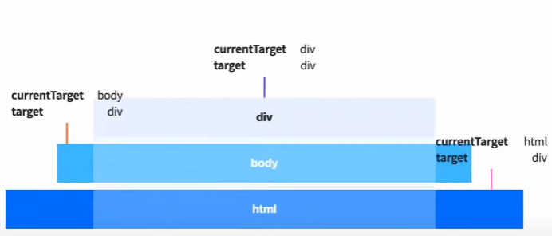
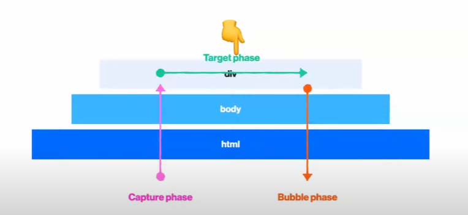

# 이벤트 흐름(flow)

## 1. 이벤트가 실행되었을 때!

```html
<html>
    <body>
        <div></div>
    </body>
</html>
```

    간단하게 위와같은 코드가 있다고 해보자.

    여기서 click이벤트를 div에 적용했다고 했을 때 div를 클릭하게 되면 click이벤트가 실행이 되는데
    여기서 div를 눌렀다고 해서 div 딱! 하나만 눌렀다고 표현하기 굉장히 애매하다.

    그 이유는 div를 감싸고 있는 body도 있고 html도 있는데 그렇다면 얘는 div를 누른것인지 body를
    누른 것인지 html을 누른것인지 딱 정의하여 표현하기가 굉장히 애매하다는 것이다.

    따라서 브라우저는 어떤식으로 처리를 하냐면 div를 감싸고 있는 여러 부모요소가 있을 때 그 부모요소들
    에게도 똑같이 click 이벤트가 있다면 그 부모요소들의 이벤트들도 다 같이 실행시켜버린다.

    그래서 div를 이벤트의 시발점이라 부르고 그 부모요소들에게 딸린 이벤트들이 탑승한다고 표현한다.
    그러나 부모요소들에게 이벤트가 없다면 실행하지 않음!



    앞서 언급한 예제코드를 위와같이 표현할 수 있다.

## 2. 이벤트 플로우

```html
<body>
    <article class="parent">
        <button class="btn" type="button">버튼</button>
    </article>

    <script>
        const parent = document.querySelector('.parent');
        const btnFirst = document.querySelector('.btn');
        btnFirst.addEventListener('click', (event) => {
            console.log('btn capture!');
        });

        window.addEventListener(
            'click',
            () => {
                console.log('캡쳐링 이벤트 발생!');
            },
            true
        ); // true : 캡처링 단계의 이벤트가 발생하도록 합니다.
        // true를 넣어줘야 캡쳐링단게에서 캡쳐링이벤트를 같이 실행하며 기본값은 false

        document.addEventListener(
            'click',
            () => {
                console.log('document capture!');
            },
            true
        );

        parent.addEventListener(
            'click',
            () => {
                console.log('parent capture!');
            },
            true
        );

        btnFirst.addEventListener('click', (event) => {
            console.log('나는야 Target!');
        });

        parent.addEventListener('click', () => {
            console.log('페런트 버블');
        }); // 버블링 단계에서 버블링이벤트를 실행하는 기준은 false일때.

        document.addEventListener('click', () => {
            console.log('document bubble!');
        });

        window.addEventListener('click', () => {
            console.log('window bubble!');
        });
    </script>
</body>
```

    그렇다면 위와같이 클릭이벤트를 발생시켰을 때 누구를 먼저 실행시켜줘야 하는가?

    그에 대한 답은 정해져있는데 맨 처음에 위의 예제에서 버튼을 클릭하여 클릭이벤트가 발생이 되면 브라우저에서 가장가까운
    이벤트부터 탐색을 하기 시작한다.

    즉, window부터 탐색을 시작하는데 이 단계를 캡쳐링단계 (capture phase) 라고 한다.
    그렇게 쭉 탐색을하며 동일한 이벤트를 실행시켜주는데 캡쳐링 단계에서 이벤트를 실행시켜주는 기준은

    addEventListner(type, listener, useCapture)의 useCapture 즉, 세번째 매개변수가 true이며,
    동일한 이벤트일 때 캡쳐링단계에서 이벤트를 실행시켜준다.

    그렇게 차례대로 내려오다가 클릭이벤트가 발생한 target을 찾게되면 캡처링 단계를 끝내고 target에 대한 이벤트를 실행시킨 뒤

    다시 DOM 트리를 따라 올라가면서 (마치 부메랑과 같이) 만나는 모든 이벤트 리스너를 다시 실행하는데
    이 단계를 버블링 단계(Bubble phase)라고 하며, 버블링 단계에서 이벤트를 실행하는 기준은
    useCapture의 매개변수가 false일 때 이며, false는 addEventListner의 Default값이다.



    위의 이미지를 참고하자.

---

    정리 : 이벤트가 발생되었을 때 기본동작은 bubble이며, bubble은 target기준 위로 올라가며 발생한다.
    true를 통해 캡쳐링단계에서 실행시켜줄 수 있으며, 이 말은 곧 이벤트가 발생하면 어쨌든 캡쳐링단계나
    버블링 단계에서는 실행이 되어야 하므로 양자택일이라 볼 수 있다.

> propagate란? (사상||신조||정보를) 전파하다.

> 캡쳐링 단계 = Capture phase = propagate

> 버블링 단계 = Bubble phase = propagate down 같은 맥락으로 버블링 단계도 설명가능.

> propagate up? down? 인 이유는 브라우저 입장에선 어쨌든 이벤트를 전파하는 것이기 때문.
> 방향에 따라 up과 down

## 3. target과 currentTarget

    currentTarget : 이벤트의 진짜 주인
    target : 이벤트의 시발점 즉, 이벤트가 누구 떄문에 실행이 됐느냐

## 4. 이벤트 위임

    이벤트 위임이란 모든 자식요소에게 동일한 이벤트를 발생시키고 싶을 때 사용하는 테크닉인데,

    그럴때 부모에게 이벤트리스너를 달아주면 모든 자식들에게 이벤트가 전달이 된다.

```js
    <body>
        <article class="parent">
            <ol>
                <li><button class="btn-first" type="button">버튼1</button></li>
                <li><button type="button">버튼3</button></li>
                <li><button type="button">버튼2</button></li>
            </ol>
        </article>

        <script>
            // 이벤트 위임을 이용하면 일일히 요소를 찾아서 이벤트를 달아줄 필요가 없습니다.
            // 캡처링과 버블링때문에 가능함.
            const parent = document.querySelector('.parent');
            parent.addEventListener('click', function (event) {
                console.dir(event.target);
                if (event.target.nodeName === 'BUTTON') {
                    event.target.innerText = '버튼4';
                }
            });
        </script>
    </body>
```

    위와 같이 사용을 해주면 자식요소의 버튼들에 하나하나 이벤트리스너를 달아주지 않더라도
    모든 버튼들에 이벤트를 적용시킬 수 있다.

## 5. 이벤트의 this

    이벤트 리스너 함수 내부에서의 this값은 이벤트가 연결된 노드를 참조함.

    즉, event.currentTarget과 참조값이 유사하다고 생각하면 된다.

    단, 화살표함수로 쓴다면 this가 가리키는 대상이 달라지는데 이때는 자신을 둘러싸고 있는
    외부 환경의 this값을 참조함.

## 6. call

    querySelectorAll로 동일한태그를 모두 가져오면 nodeList가 된다.

    이 nodelist에도 forEach를 사용할 수 있는데 여기서 주의할 점은 nodelist의 forEach는
    IE에서 지원이 안된다는 점이다.

    참고로 nodelist의 forEach와 Array의 forEach는 다릅니다!

    따라서 IE에서도 대응할 수 있게 nodelist의 forEach를 사용할 수 있다.

```js
Array.prototype.forEach.call(txts, (item) => {
    item.addEventListener('click', (event) => {
        event.stopPropagation();
        alert(item.innerText.slice(0, -2)); // 이벤트 위임을 사용할 것이라면 target사용
    });
}); // 첫번째 인자는 바꾸어줄 객체를 입력 즉, 메서드를 빌려온다.
```

    위의 코드처럼 call함수를 사용하면 되는데 첫번째 인자로 바꾸어줄 객체를 입력한다.
    즉 Array의 메서드를 빌려 nodelist에서 사용을 하는 것이다.

    그렇기때문에 IE에서도 지원이 가능한 nodelist forEach문을 사용할 수 있는 것이다.
