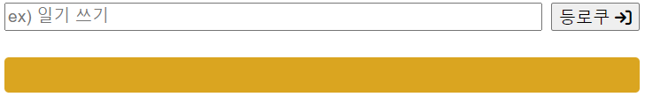
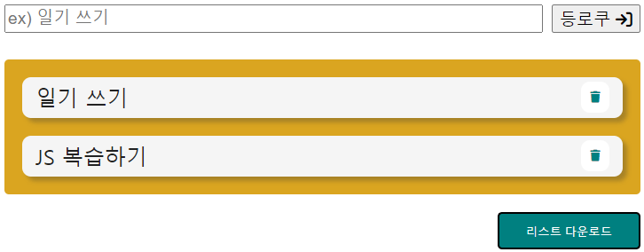

# todoList 구현

## 초반 설계



위의 이미지는 아무것도 입력하지 않았을 때의 상태



위의 이미지는 무언가를 입력하였을 때의 상태입니다.

    구현하고자 하는 것은 할 일을 등록하였을 때 할 일이 localStrage에 저장이 되어 저장이 된
    값들을 화면에서 계속 띄워줍니다.

    그렇기 때문에 새로고침을 하여도 화면에는 저장된 값이 계속 출력이 됩니다.

    또한 입력을 하자마자 리스트 다운로드 버튼이 생성되고 나머지 li와 지우는 버튼이 생성이 됩니다.

    또한 삭제 버튼을 누르면 localStorage에서도 삭제가 되어 새로고침을 하게되면 삭제 된 리스트는
    화면에서 사라지게 됩니다.

위의 계획대로 JS를 작성해보겠습니다!

## 변수 가져오기

```js
const main = document.querySelector('.artcl_main');
const userTask = main.querySelector('header input');
const addBtn = main.querySelector('header button');
const listTodo = main.querySelector('.list_todo');
```

위와 같이 컨트롤 해줄 변수들을 모두 가져왔습니다.

main은 전체를 감싸고있는 태그, userTask는 입력하는 input, addBtn은 등록버튼, listTodo는 ul 태그입니다.

---

## 할일 추가 이벤트

등록 버튼을 클릭하였을 때 이벤트를 등록해줍니다.

```js
addBtn.addEventListener('click', createListItem);
```

---

## createListItem 함수가 하는 일

```js
function createListItem() {
    const inpVal = userTask.value;

    if (inpVal) {
        const tempTask = {
            val: inpVal,
            checked: false,
        };

        tasks.push(tempTask);

        genItem(inpVal);

        saveTasks();

        showDownLoad();
    } else {
        errorMsg('내용을 작성해주세요.');
    }
}
```

위와 같이 함수를 작성해주었는데 순서대로 먼저 입력한 값을 저장하는 변수를 만들어주었습니다.

그 뒤 만약 값이 입력이 되었다면 그 입력된 값은 tempTask라는 객체에 저장이 되고 그 객체는  
tasks라는 배열에 push가 됩니다.

그 후 list를 생성해주는 genItem 함수는 화면에 입력한 값을 토대로 li태그와 삭제버튼을 생성해줍니다.

그 다음 saveTasks 함수는 우리가 입력한 tasks에 있는 데이터를 localStorage에 저장을 해줍니다.

그 다음 다운로드 버튼을 노출해주는 함수를 통해 다운로드 버튼을 출력합니다.

만약 값을 적지 않았다면 errorMsg함수를 통해 내용을 작성하라는 메시지를 띄워주도록 합니다.

---

## 1. genItem 함수 작성

genItem함수는 list를 생성합니다.

```js
function genItem(inpval) {
    const li = document.createElement('li');
    li.textContent = inpval;
    listTodo.appendChild(li);

    // 인풋 입력값 초기화
    userTask.value = '';

    li.addEventListener('click', () => {
        li.classList.toggle('done');

        buildTasks();
    });
}
```

우선은 위와 같이 함수를 작성해주었습니다.

위의 함수의 기능은 우선 inpVal을 파라미터로 설정해주었습니다.  
여기서 inpVal은 처음 createListItem의 변수이며 userTask.value를 말합니다.

제일 먼저 li태그를 생성해준 뒤 li태그의 텍스트는 inpVal 즉, 우리가 입력한 값으로 적어줍니다.

그 뒤 listTodo(우리가 불러온 ul) 에 li를 추가해준 뒤 userTask.value를 초기화 해주는데 그 이유는  
초기화를 해주지 않으면 인풋창에는 입력한 값이 계속 남아있기 때문입니다.

그 뒤 생성된 li태그를 클릭하였을 때 완료되었음을 표시하는 line-through를 그려주기 위해  
li에 click이벤트를 달아 done이라는 class이름을 설정해주었습니다.

그 뒤 buildTasks함수를 li를 클릭하였을 때 실행하게 해두었는데 후에 buildTasks함수는  
할 일 정보를 업데이트 하는 함수이며 할 일을 클릭하여 완료선이 그어졌을때 혹은 할 일을 제거했을 때  
액션을 취하는 함수입니다.

## 1-2. 삭제버튼 생성하기

genItem함수에 이어서 삭제버튼을 만들어 주겠습니다.

```js
// 삭제버튼 만들기
const btn = document.createElement('button');
btn.innerHTML = '<i class="fa-solid fa-trash"></i>';
li.appendChild(btn);

btn.addEventListener('click', () => {
    event.stopPropagation();
    li.remove();

    buildTasks();

    showDownLoad();
});
```

genItem함수에 이어서 위와 같이 삭제버튼을 만들어 주었습니다.

우선 삭제할 button을 만들어줍니다.

그 뒤 innerHTML을 사용하였는데 그 이유는 폰트어썸에서 가져온 속성을 적용시켜주기 위해서입니다.  
그리고 li에 만든 버튼을 추가해주었고 btn에 클릭 이벤트를 달아주었습니다.

클릭 이벤트에는 stopPropagation함수가 적용되어 있는데 삭제버튼을 클릭시 클릭 이벤트가 부모요소를  
타고 올라가 li에게도 전달이 됩니다.(버블링)  
그리고 우리가 작성한 코드를 보면 li또한 click이벤트 이므로 버블링에 의해 li의 클릭이벤트가 실행이 됩니다.

이때 li 클릭이벤트에 적용되어 있는 buildTasks함수가 실행이 되기 때문에 버블링을 차단해주기 위해  
사용을 해주었습니다.

그 뒤 클릭시 li를 지워주기 위해 remove를 해주었고

할 일 정보를 삭제했을 때 또한 업데이트 해주기 위하여 buildTasks함수를 실행시켜 주었습니다.

그 뒤 showDownLoad함수는 리스트를 다운로드 하는 버튼을 출력해주는 함수인데  
모든 리스트가 삭제되었을 때 리스트 다운로드 버튼을 없애주기 위해 showDownLoad함수를 실행시켜주었습니다.

---

## 2. saveTasks함수 작성

```js
const tasks = JSON.parse(localStorage.getItem('tasklist')) || [];

function saveTasks() {
    localStorage.setItem('tasklist', JSON.stringify(tasks));
}
```

saveTasks함수는 위와 같이 로컬스토리지에 tasks를 저장해주는 역할을 합니다.  
까먹을까봐 tasks를 한 번 더 적어주었습니다.

---

## 3. buildTasks함수 작성

buildTasks함수는 할 일 정보를 업데이트 해주는 역할을 합니다.  
할 일을 클릭하여 line-through를 그려주었을때, 그리고 버튼을 눌러 할 일을 제거했을 때  
실행시켜주는 함수입니다.

```js
function buildTasks() {
    tasks.length = 0;
    const curList = listTodo.querySelectorAll('li');

    curList.forEach((el) => {
        const tempTask = {
            val: el.textContent,
            checked: false,
        };

        if (el.classList.contains('done')) {
            tempTask.checked = true;
        }

        tasks.push(tempTask);
    });

    saveTasks();
}
```

위와 같이 buildTasks함수를 작성해주었습니다.

우선 첫번째로 새로운 데이터를 기준으로 다시 tasks를 만들어주기 위해 기존 데이터를 초기화 시켜주었습니다.

그 뒤 ul태그에 들어있는 모든 li태그를 변수에 담은 뒤 forEach를 통해 순회를 돌게 하였습니다.

그렇게 새로운 정보를 토대로 다시 tempTask라는 객체를 만들어 주었습니다.

또한 완료선이 그어졌을 때 즉, done이라는 class네임을 보유하고 있을 때에는 객체의 false를  
true로 바꾸어주게 만들었습니다.

그 뒤 tasks에 새로운 정보를 push해준 뒤 새로운 정보를 localStorage에 저장하기 위해 마지막에  
saveTasks함수를 실행시켜주었습니다.

---

## 4. showDownLoad함수 작성

```js
function showDownLoad() {
    const curList = listTodo.querySelectorAll('li');

    if (curList.length > 0) {
        downLoadBtn.style.display = 'block';
    } else {
        downLoadBtn.style.display = 'none';
    }
}
```

위와 같이 작성해주었고 마찬가지로 curList로 모든 li를 가져왔습니다.

그 뒤 curLIst의 length가 0보다 크다면 즉, nodelist가 있다면 다운로드 버튼이 보이게하고  
모든 nodelist가 지워져 length가 0이된다면 다운로드 버튼을 없애주기 위해 위와 같이 작성해주었습니다.

---

## 5. downLoadBtn 생성하기

downLoadBtn이라는 버튼이 아직 생성되지 않았기때문에 이를 생성해주겠습니다.

```js
const downLoadBtn = document.createElement('button');
downLoadBtn.classList.add('btn');
downLoadBtn.textContent = '리스트 다운로드';
main.appendChild(downLoadBtn);
downLoadBtn.addEventListener('click', downLoadFile);
```

위와 같이 생성을 해주었고 btn이라는 속성은 미리 css로 적용해둔 스타일 속성입니다.

또한 click이벤트를 달아준 이유는 클릭을 하였을 때 우리가 작성해둔 list를 다운받기 위해서입니다.

---

## 6. 중간점검

여기까지 완성된 결과물을 보면 인풋창에 값을 입력시 li태그와 삭제버튼이 생성이 되며 li버튼을 클릭시  
완료를 의미하는 선이 그어집니다.

또한 li태그가 하나라도 생성이 되었다면 리스트를 다운할 수 있는 버튼이 생성되며, 삭제버튼으로 모든  
li태그를 지웠을 땐 리스트를 다운할 수 있는 버튼이 사라지게 됩니다.

---

## 7. errorMsg함수 작성

errorMsg함수는 인풋창에 값을 입력하지 않았을 때 실행시켜줄 함수입니다.

```js
function errorMsg(msg) {
    message.style.display = 'block';
    message.textContent = msg;
    userTask.focus();
}
```

위와 같이 함수를 작성해주었습니다.

파라미터에는 msg로 받을 수 있게 설정을 해주었고 여기서 msg는 createListItem의 함수에서 else의 경우  
실행이 되는 함수에 적어준 메시지를 뜻합니다.  
errorMsg함수가 실행이 되면 message라는 태그의 display를 보이게 하였고 textCotent로 받아온 인자값을 넣어주었습니다.

마지막 focus는 userTask 즉 우리가 입력하는 인풋창에 입력할 수 있게 focus를 해주는 속성입니다.

---

## 8. message 생성하기

```js
const message = document.createElement('strong');
message.style.display = 'none';
message.classList.add('txt_invalid');
main.appendChild(message);
userTask.addEventListener('input', () => {
    message.style.display = 'none';
});
```

위와 같이 message를 생성해주었습니다.

먼저 strong태그로 생성을 하여 메시지를 삽입해주었습니다

그 뒤 display를 none으로 주어 우선 화면에서 없애준 뒤 미리 적용해놓은 class를 추가해주었습니다.

그 후 main에 추가를 해주었고 마지막 input이벤트는 값을 입력하자마자 경고문구를 지워주기 위해  
input이벤트를 적용해주었습니다.

---

## 9. downLoadFile() 함수 생성하기

downLoadFile함수는 우리가 리스트다운로드를 클릭하였을 때 우리가 입력한 li들을 다운할 수 있게 해주는  
함수입니다.

앞서 리스트 다운로드 버튼에 click이벤트로 전달해준 함수가 downLoadFile함수입니다.

```js
function downLoadFile() {
    let temp = '<나의 할일 목록>\n\n';

    const curList = listTodo.querySelectorAll('li');

    curList.forEach((el) => {
        if (el.classList.contains('done')) {
            temp += '완료 -';
        }
        temp += `${el.textContent}\n`;
        console.log(temp);
    });

    let element = document.createElement('a');

    element.setAttribute('href', `data:text/plain; charset=utf-8, ${temp}`);

    element.setAttribute('download', 'todoList.txt');

    element.click();

    element = null;
}
```

위와 같이 함수를 작성해주었습니다.

위에서 다운로드 속성에 값을 설정하면 그 값이 파일명이 됩니다.

또한 click은 클릭가능한 요소라면 클릭을 시뮬레이션 하며 앵커를 클릭한 것과 똑같은 현상이 발생합니다.

그 후 메모리상에서 a태그를 제거해주기 위해 null로 해주었는데 지워주지 않아도 큰 상관은 없지만  
메모리를 아끼기위해 제거해주는 것이 좋습니다.

---

## 10. 마지막

```js
if (tasks.length > 0) {
    tasks.forEach((task) => {
        genItem(task.val, task.checked);
    });
    showDownLoad();
}
```

마지막으로 새로고침을 하여도 계속해서 화면에 출력될 수 있게 위와 같이 코드를 작성해주었습니다.

만약 tasks의 길이가 0이상이라면 즉, 우리가 작성한 값이 있다면 하나씩 순회를 하며 genItem함수를  
실행시켜 줍니다.
