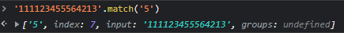
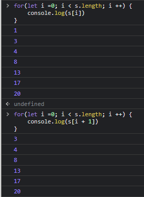

# 워밍업 문제 1

1부터 10,000까지 8이라는 숫자가 총 몇번 나오는가?

8이 포함되어 있는 숫자의 갯수를 카운팅 하는 것이 아니라 8이라는 숫자를 모두 카운팅 해야 한다.
(※ 예를들어 8808은 3, 8888은 4로 카운팅 해야 함)

문제 링크 : https://codingdojang.com/scode/393

---

## 워밍업 문제 1의 첫 번째 방법

```js
let str = '';

for (let i = 1; i <= 10000; i++) {
    str += i;
}

console.log(str.match(/8/g).length);
```

1. `let str = ''` 라고 선언해주면 아무값도 들어있지 않은 '' 빈 스트링이 생성이 된다.

2. 그후 `for문`을 이용하여 `i`가 1부터 10000까지 순회를 돌게 한 뒤 `i`를 `str`에 누적해준다.

3. 그렇게 되면 `str`에는 `'12345678910111213.....9998999910000'` 과 같이 값이 누적되어 들어가게 된다.

4. 그 후 `str.match()`를 해주는데 `match`는 `string`의 메서드이며 아래의 이미지와 같이 반환해준다.
   

5. 괄호안에 위의 이미지와 같이 적어주게 되면 모든 값을 찾지않고 가장 먼저나오는 값만 반환해주기 때문에  
   정답에서 보이듯 `match(/8/g)` 와 같이 적어주게 되면 `str`에 들어있는 모든 8을 배열로 반환해준다.

6. 그 후 배열된 반환의 길이를 `length`로 구해주면 정답을 구할 수 있다! 정답은 `4000`

---

## 워밍업 문제 1의 두 번째 방법

```js
Array(10000)
    .fill(0)
    .map((n, index) => n + index)
    .join('')
    .match(/8/g).length;

Array(10)
    .fill(0)
    .map((n, index) => n + index)
    .toString();
```

들어가기 전에 `Array생성자`로 `array`를 생성하게 되면 `[empty x 10]` 이라는 배열을 반환한다.
이는 undefined가 10개가 있는 것이 아니라 말 그대로 빈 `empty`가 10개 있는 것이다.

따라서 `let test = Array(10)` 으로 생성해준 뒤 `test[2] = null` 이라고 해주면 `[empty x 2, null, empty x 7]` 을 반환한다.

그러나 이 빈 array를 `for of`문으로 순환하면 `undefined`를 출력하는데 그렇다고해서 헷갈리지 말자!

---

1. 새로운 Array를 10000개를 생성해준다.

2. 그 뒤 모든 빈 array를 `fill()`을 통해 0으로 가득 채워준다.

3. `map()`으로 1부터 10000까지 채워준다 위에서 `n + index`를 해준 이유는 1부터 채우기 위해

4. `join()`으로 10000개의 요소를가진 array를 나누어줄 것인데 `join()`만 해주면 `'1,2,3,4....'`와 같이  
   출력이 되고 `join('')`를 해주게 되면 `'12345678910....9998999910000'`으로 출력이 된다.

5. 그 뒤 앞선 예제에서의 방법과 똑같이 string의 메서드인 `match()`를 사용해 문제를 풀어준다.

6. 그러나 `join()`도 좋지만 `toString()`을 사용해주면 좀 더 직관적이고 좋다.

---

## 워밍업 문제 1의 세 번째 방법

```js
let arr = [];
for (let i = 1; i <= 10000; i++) {
    arr.push(i);
}
let result = [...arr.join('')].filter((el) => el === '8').length;
console.log(result);
```

1. arr에 push를 해주기 위해 먼저 빈 arr을 생성해줍니다.

2. 그 뒤 for문을 통해 10000번 순회를 도는 값을 만들어둔 `arr`에 push해줍니다.

3. 그 뒤 `filter()`메서드를 활용하기 위해 전개구문을 활용해 `[...arr.join('')]` 이렇게 해준 뒤  
   `filter()`메서드를 활용해 `'8'` 이라는 값을 가진 배열을 반환해줍니다.

4. 그리고 `length`로 길이를 반환해주면 정답!

---

# 워밍업 문제 2

1차원의 점들이 주어졌을 때, 그 중 가장 거리가 짧은 것의 쌍을 출력하는 함수를 작성하시오. (단 점들의 배열은 모두 정렬되어있다고 가정한다.)

예를들어 S = [1, 3, 4, 8, 13, 17, 20] 이 주어졌다면, 결과값은 (3, 4)가 될 것이다.

문제링크 : https://codingdojang.com/scode/408

---

## 워밍업 문제 2의 첫 번째 방법

```js
let s = [1, 3, 4, 8, 13, 17, 20];
let arr = [];

for (let i = 1; i < s.length; i++) {
    arr.push(s[i] - s[i - 1]);
}

let index = arr.indexOf(Math.min(...arr));
console.log(s[index], s[index + 1]);
```

1. `let s = [1, 3, 4, 8, 13, 17, 20]` 가 주어졌을 때 가장 거리가 짧은 즉, 두 수의 차가 가장 작은  
   쌍을 알아내야 한다.

2. 그러기 위해선 뒤의 index에서 앞의 index를 빼주면 되는데 이 과정을 적어보겠습니다.

3. 먼저 앞의 요소와 뒤의 요소를 구한 뒤 이를 빼줘야 하므로 `for of`문은 적절치 않습니다.

4. 그렇다면 `for in`문은? => `for in`문 또한 제가 방법을 못찾은건지 차를 구하는 용도로 쓰기에는  
   적절치 않은 것 같습니다.

5. 일반적인 for문을 사용해 아래의 이미지와 같이 앞의 index와 뒤의 index를 출력할 수 있습니다.



6. 여기서 문제점은 `s[i+1]`을 해주고 있는데 순회는 `s.length`만큼 돕니다.  
   `s.length`는 7인데 `s[7+1]` 번째 index는 존재하지 않으므로 undefined를 출력합니다.

7. ```js
   for (let i = 0; i < s.length - 1; i++) {
       console.log(s[i + 1]);
   }
   ```

    위와 같은 방법이 있고

8. ```js
   for (let i = 1; i < s.length; i++) {
       console.log(s[i] - s[i - 1]);
   }
   ```

    위의 방법을 사용하여 처음부터 i를 1부터 순회하게 한 뒤 두 수의 차를 구해줄 수 있습니다.

9. 이렇게 두 수의 차를 구했다면 이 수들을 우리가 앞서 만든 빈 `arr`에 `push()`해주도록 합니다.

10. `let result = arr.indexOf(Math.min(...arr))` 그 뒤 이렇게 arr에 indexOf를 해주는데,  
    Math.min을 사용하여 가장 작은 수를 찾게 합니다.  
    여기서 `...arr`를 사용한 이유는 `Math.min(arr)` 해주면 `Math.min`입장에선 그냥 배열의 덩어리를  
    받는 것이므로 NaN을 출력하기 때문에 이를 전개구문을 사용하여 펼쳐주도록 합니다.

11. 그렇게 가장 작은수를 찾아내면 그 수는 차례대로 뒤의 index와 앞의 index를 뺀 값을 push해준  
    arr에서 찾아낸 값이므로 `s[result]` 가 앞의 index가 되고 `s[result + 1]`이 뒤의 index가 되어  
    답을 구할 수 있게 됩니다!

## 워밍업 문제 2의 첫 번째 방법

```js
let dots = [1, 3, 4, 8, 13, 17, 20];
let 최솟값 = Infinity;
let 최솟값인덱스 = 0;

for (let i = 1; i < dots.length; i++) {
    if (Math.abs(dots[i] - dots[i - 1]) < 최솟값) {
        최솟값 = Math.abs(dots[i] - dots[i - 1]);
        최솟값인덱스 = i;
    }
}
console.log(dots[최솟값인덱스], dots[최솟값인덱스 - 1]);
```

1. 최솟값을 Infinity로 설정해준 이유는 처음 순회를 돌 때 if의 조건문을 무조건 만족시켜주기  
   위해서입니다.

2. 최솟값인덱스를 0으로 해준 이유는 딱히 없습니다 `let 최솟값인덱스;` 라고 해주어도 결과값은 똑같으나  
   그냥 명시적으로 0이라고 해주었습니다
