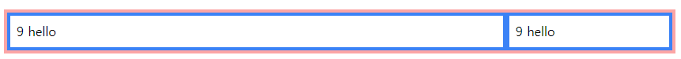

# Tailwind

    Tailwind 란?

    CSS파일을 따로 만들지 않고 HTML내에서 웹 사이트 구축이 가능하게 만드는 것
    즉, 미리 구현된 CSS를 사용하는 것이다.

    반드시 3버전 이상을 사용할 것을 권장한다.

    그 이유는 구버전에서는 cdn 다운로드 속도에서 차이가 크기때문.

## 1. 기본 예제 다뤄보기.

    주로 다루는 예제들을 정리해보자

    1. space-y-8 : 각 요소의 간격 (space-x-8)

    2. bg-red-200 : red color 숫자가 높아질수록 진해짐

    - color는 같은 숫자일 때 우선순위를 강제로 가지게 되어 class 순서와는 상관없이
    color를 가지는 경우가 있으니 주의!

    3. shadow : 그림자

    4. rounded : radius, rounded-full: 구

    5. w-96 : width 값을 설정하는데 px 이나 %가 아니라 rem임 기본 단위는 0.25

    - width의 경우 w-1/4 와 같이 사용하기도 하는데 width를 1/4만큼만 차지하며
    브라우저의 크기에 따라 길이가 유동적으로 변함.

    6. mt,mb,ml,mr : top, bototm, left, right 로 조절이 가능하며 height와 padding도 조절가능.

    -my, mx 와 같이도 사용이 가능한데 my는 위아래 mx 는 왼쪽 오른쪽으로 적용된다.

## 1-2. Typography

    텍스트의 크기를 조절함

    1. text-xs

    2. text-sm

    3. text-base

    4. text-lg

    5. text-xl

    6. text-2xl

    위와 같이 폰트 사이즈 조절이 가능하며 역시나 단위는 rem이다.

https://tailwindcss.com/docs/font-size

    위의 사이트 참고.

## 1-3. shadow

        shadow-sm
        shadow
        shadow-md
        shadow-lg
        shadow-xl
        shadow-2xl(작동하지 않는 이슈 있음)
        shadow-inner
        shadow-none

    위와 같이 shadow도 사용가능.

## 2. 기본 속성 살펴보기

    주어진 값 외에 다른 값을 사용하고 싶을 때에는 arbitrary value를 사용할 수 있음.

    기존에는 text-xs 와 같이 사용한다면 내가 원하는 px값을 넣고 싶을 땐
    text-[17px] 과 같이 [원하는 값] 을 넣어 사용하면 된다.

    arbitrary value는 text뿐만 아니라 값을 넣을 수 있는 곳에 [] 을 사용해 적용이 가능하다.

## 3. etc..

    1. class에 list-disc를 추가하면 ul의 기본 점박이를 생성한다.

    2. list-demical은 ol의 기본 스타일을 적용시킴.

    3. border는 다른 속성들과 다르게 px단위 이며 나머지는 대부분 rem이다.

    4. border-l,r,t,b 와 같이 네방향으로 스타일을 적용할 수 있음.

    - 참고로 모든 번호가 순차적으로 매겨져있는 것은 아니다 특정 번호들은 없는 경우도 있음.

## 4. flex & grid

    Tailwind에서는 flex와 grid를 손쉽게 사용가능하다.

    flex를 주고싶은 부모 컨테이너에

```html
<div class="flex flex-col flex-wrap border-4 border-red-300 m-3">
    <div class="p-2 border-4 border-blue-500">1 hello</div>
    <div class="p-2 border-4 border-blue-500">1 hello</div>
    <div class="p-2 border-4 border-blue-500">1 hello</div>
    <div class="p-2 border-4 border-blue-500">1 hello</div>
</div>
```

    1. 위와 같이 flex를 주면 flex가 적용되며 방향의 경우 flex-col을 주면 column방향으로 정렬
    기본값은 row

    2. flex-wrap을 주면 wrap이 적용됨.

        justify-content: center        - justify-center
        justify-content: space-between - justify-between
        align-items: flex-start        - items-start
        align-items: center            - items-center
        align-self: auto               - self-auto
        align-slef: flex-start         - self-start
        align-slef: flex-end           - self-end
        flex: 1 1 0%                   - flex-1
        flex: 1 1 auto                 - flex-auto
        flex: 0 1 auto                 - flex-initial
        flex: none                     - flex-none

    자주쓰는 속성이며 참고하도록 하자.

    3. 부모 컨테이너에 space-x-3 과 같은 값을 주게되면 margin-left를 준 값과 똑같이 아이템들에게 적용됨.

    space-y는 margin-top값

```html
<div class="flex border-4 border-red-300 m-3">
    <div class="w-3/4 p-2 border-4 border-blue-500">9 hello</div>
    <div class="w-1/4 p-2 border-4 border-blue-500">9 hello</div>
</div>
```

    앞서 말한 것 처럼 width값을 /로 표현하면



    위와 같이 출력되고 화면을 줄이거나 늘렸을 때 또한 그 상태를 유지함.

```html
<div class="flex md:flex-row flex-col border-4 border-red-300 m-3">
    <div class="p-2 flex-1 border-4 border-blue-500 order-1">1 hello</div>
    <div class="p-2 flex-1 border-4 border-blue-500 order-0">2 hello</div>
    <div class="p-2 flex-1 border-4 border-blue-500 order-2">3 hello</div>
    <div class="p-2 flex-1 border-4 border-blue-500 order-3">4 hello</div>
</div>
```

    위와 같이 접근성과 모바일을 고려하여 md(미디엄 사이즈 768px) 일땐 flex-row를주고
    그 이하면 flex-col을 주어 반응형으로도 만들 수 있다.

## 4-1. flex & grid

```html
<div class="grid grid-cols-3 gap-2 border-4 border-red-400">
    <div class="border-4 border-blue-500">hello</div>
    <div class="border-4 border-blue-500">hello</div>
    <div class="border-4 border-blue-500">hello</div>
    <div class="border-4 border-blue-500">hello</div>
    <div class="border-4 border-blue-500">hello</div>
    <div class="border-4 border-blue-500">hello</div>
</div>
```

    grid는 위와 같이 사용하면 됨.

```html
<div class="col-span-2 border-4 border-blue-500">hello</div>
```

    위와 같이 col-span-2를 사용할 수 있음.

## 5. 반응형

    sm : @media (min-width: 640px)
    md : @media (min-width: 768px)
    lg : @media (min-width: 1024px)
    xl : @media (min-width: 1280px)
    2xl : @media (min-width: 1536px)
    dark : @media (prefers-color-scheme: dark)
