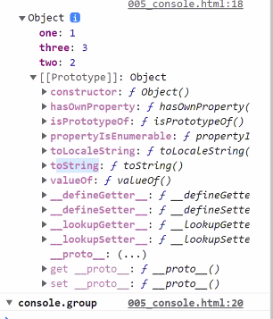
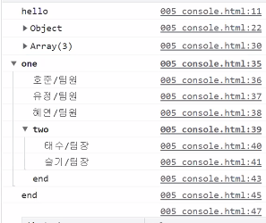
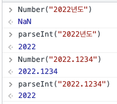
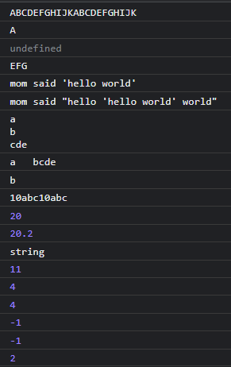
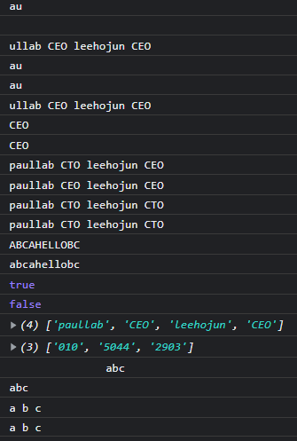
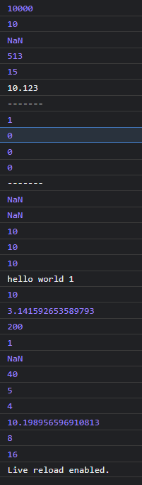

# JavaScript 기초

    HTML 을 프로그래밍으로 제어하며, 웹브라우저가 해석해서 실행할 수 있는 유일한
    프로그래밍 언어입니다.

## 1. 출력 방법

    JavaScript를 HTML에 적용시키는 방법에는 CSS와 마찬가지로 inline, 내부, 외부로 컨트롤이 가능하다.

## 1-2. HTML에 출력하기

```html
<p id="one"></p>
```

```JS
            // about:blank에서 개발자 도구를 열고, console에서 document. 이라고 치면
            // 여러가지 document 메서드를 보실 수 있습니다.
            /*
            여
            러
            줄
            주
            석
            */
            document.getElementById('one').innerHTML =
                'hello <strong>world 1</strong>';
            console.log('hello world 2');
            window.alert('hello world 3');
            document.write('hello world 4');
```

    1. document.getElementById('one') : id 값이 one인 p태그를 JS에서 컨트롤하려면 위와 같이 작성.

    2. innerHTML : innerHTML은 내가 원하는 문구를 지정한 태그에 넣을 수 있으며 그 과정에서
    HTML태그가 사용이 가능하다 innerText는 HTML태그 사용 불가능

    3. window.alert : 알람창을 띄워주는데 앞에 window. 를 붙이지 않아도 alert는 작동함.
    그러나 보통 window를 적어주는 것이 보통이며 alert는 window. 의 메서드이다.

## 1-3. console 의 메서드들

    1. console.log() : 브라우저의 콘솔창에 내가 원하는 결과 값을 출력하는데 console 이라는 것이
    꼭 브라우저를 가르키는 것 만은 아니다. node에서 console을 찍으면 node에 찍히기 때문

---

    2. console.dir() : 아래의 그림과 같이 형태가 출력되며 요소와 그 안의 값들이 출력된다.

    - console.dir로 object를 출력하면 알파벳 순으로 출력이 되는데 for문을 사용하여
    순회를 돌면 순서대로 출력이 됨.



---

    3. console.group : console.group은 주로 계층 구조를 표현할 때 사용하며, groupEnd와 같이 사용된다.

```js
console.group('one');
console.log('호준/팀원');
console.log('유정/팀원');
console.log('혜연/팀원');
console.group('two');
console.log('태수/팀장');
console.log('슬기/팀장');
console.groupEnd();
console.log('end');
console.groupEnd();
console.log('end');
```



    group를 사용하여 group을 지어주면 위와 같이 출력되며 group를 사용한 수 만큼 groupEnd를 찍어준다.

    또한 groupEnd는 안쪽부터 닫아나간다.

---

    4. console.error() : error를 출력한다

    5. console.warn() : 실행은 되지만 경고문구를 읽어봐야 한다(말 그대로 실행해주는 경고문구)

# 2. 변수

    변수는 변할 수 있는 수, 변할 수 있는 정보 라는 뜻이며, 프로그램을 만드는 데
    필요한 숫자나 문자와 같은 데이터를 보관할 공간이 필요한데,
    물건을 잠시 보관하는 상자 같은 역할을 하는 것이 변수이다.

    그러나 정확히는 let x = 10 이라는 변수가 있다면 상자에 보관하는 것이 아닌
    메모리에 x와 10을 각각 저장한 뒤 일치하는 값을 가져오는 것이 더 정확하다고 볼 수 있다.

    그렇다면 변수는 포스트잇에 비유하는 것이 더 알맞겠다.

---

## 2-1. 사용예제

```js
let x = 10;
let y = 100;
x = 15;
console.log(x + y);
```

    위와 같이 사용이 가능하며 한글로도 사용이 가능하나 권장하지 않는 편이다.
    한글 변수의 경우 사람마다 다르겠지만 권장하는 사람도 있음.

---

    변수를 선언할 때 숫자가 앞에 오면 error를 출력함.
    숫자가 뒤에 가는 것은 상관 무

---

    특수문자 또한 사용이 가능한데 특정문자들만 사용이 가능하다.

```js
let _ = 100;
```

    위와 같이 사용하기도 하는데 반복문 돌 때 의미없는 변수에 사용한다.

> 변수는 let, const, var, if, else와 같이 지정된 키워드(예약어)로 사용 불가!

## 2-2. 변수의 타입

```js
console.log(typeof 'hello world'); // string // (V)
console.log(typeof 100); // number // (V)
console.log(typeof NaN); // number
console.log(typeof true); // boolean // (V)
console.log(typeof undefined); // undefined // (V)
console.log(typeof Symbol()); // symbol
console.log(typeof null); // object, 여기서부터 js가 어려워 집니다.
console.log(typeof []); // object, 여기서부터 js가 어려워 집니다. 왜 Array가 아닐까요?
console.log(typeof {}); // object
console.log(typeof function () {}); // function
console.log(typeof /정규표현식/gi); // object

console.log('----------');
console.log(10 + 10);
console.log('10' + 10);
console.log('10' + '10');
console.log(10 + '10');

console.log('----------');
// 형변환은 형태를 변경하는, 타입을 변경하는 것을 의미합니다.
console.log(Number('10') + Number('10')); // 권장하지 않습니다.
console.log(parseInt('10') + parseInt('10')); // 권장합니다.
console.log(String(10) + String(10));
```

    위와 같이 내가 원하는 변수의 type을 typeof 를 통해 확인할 수 있으며, type을 확인하면
    해당 type에 대해 검색도 가능하고 변수가 길어졌을 땐 육안으로 확인이 힘들기 때문에
    typeof로 type을 확인하는 습관을 들이면 좋다.

## 2-3. NaN

    NaN 은 Not a Number의 약자이며 number로 분류되는데 그 이유는 숫자 값이지만
    컴퓨터로는 표현할 수 없는 숫자값이기 때문이다.

    또한 표현 불가능한 수치형 결과를 나타내느 값이다.

## 2-5. parseInt, Number

    String을 Number로 형변환 하는 것에는 두가지 방법이 있다.

    첫번째는 parseInt를 사용하는 것이고 두번째는 Number를 사용하는 것이다.

    이 둘에게는 차이점이 있는데,

    1. parseInt() : let txt = '10abc' 를 parseInt로 형변환을 해주면 10만 출력해준다.
    즉, parseInt는 분석 후 정수로 바꾸어준다 단, 숫자앞에 'abc10' 이런식으로 string이
    있으면 NaN을 출력한다.

    2. Number() : parseInt()와는 다르게 오직 숫자로만 이루어진 String만을 변환함.
    즉, number()는 통짜로 숫자형으로 바꿔버리려 하기 때문에 string이 있기만해도
    NaN을 출력함.



    위의 그림과 같이 소숫점에 관련해서도 약간의 차이점을 보이는데
    parseInt를 사용하여 소숫점까지 모두 표현해주고 싶다면 parseFloat() 을 사용하면
    소숫점까지 출력이 가능.

-참고 : Int는 정수형 Float은 실수 (정수는 -값을 포함)

## 2-6. etc..

```js
let txt2 = "mom said "hello world"";
\"hello world\"
```

    위와 같이 출력을 하면 에러를 출력하는데 쌍따옴표가 중복되기 때문이다.
    홑따옴표를 써서 문제를 해결할 수도 있지만, 이스케이프 문자를 활용해
    감싸주면 정상적으로 출력이 된다

    대표적으로 \n과 \t도 있는데 \n은 엔터키 \t는 탭키이다 또한 \n,\t 자체를
    하나의 문자로 인식함.

# 3. String

    string (문자열) 은 '' 나 "" 로 둘러싼 것을 말하며 문자열에는 순서가 있다.
    순서가 있는 자료형을 시퀀스형 자료형이라고 하며, 순서는 0부터 시작하며
    띄어쓰기도 문자로 취급한다.

    이 순서를 index라고 부르며 index로 호출하는 것을 indexing이라고 한다.

```js
//string, 문자열
let txt = 'ABCDEFGHIJK';
let txt2 = "mom said 'hello world'";
let txt3 = 'mom said "hello \'hello world\' world"';
let txt4 = 'a\nb\ncde';
let txt5 = 'a\tbcde';
let txt6 = '10abc'; // "10.1", "100.1abc" (parseFloat)
let txt7 = '10.1abc';
console.log(txt + txt);
console.log(txt[0]);
console.log(txt[-1]); // undefined가 출력.
console.log(txt[4] + txt[5] + txt[6]);
console.log(txt2);
console.log(txt3);
console.log(txt4);
console.log(txt5);
console.log(txt5[2]); // /t를 1개의 문자열로 처리합니다.
console.log(txt6 + txt6);
console.log(parseInt(txt6) + parseInt(txt6));
// console.log(Number(txt6) + Number(txt6));

console.log(parseFloat(txt7) + parseFloat(txt7));

console.log(typeof txt);
// console.dir(txt2);

// 스트링에 메서드
console.log(txt.length); // 11개의 글자지만, index는 length-1

console.log(txt.indexOf('E')); //라고 하면 index가 반환되므로 4가 출력됨.
console.log(txt.search('E')); // search도 위치를 반환.

// indexOf는 정규표현식을 허용하지 않음.
console.log(txt.indexOf('z'));
console.log(txt.search('z'));

let regExp = /CD/;
console.log(txt.search(regExp));
```



    위의 코드를 콘솔창에 출력하면 이미지와 같이 출력이 된다.

    1. txt + txt = 'ABCDEFGHIJKABCDEFGHIJK' 로 출력이 되며 string끼리 더하면 이어 붙임.


    2. txt[0] = A 로 출력되며 txt의 index중 0번째 즉, A를 출력한다.


    3. txt[-1] = undefined가 출력됨. (왜 undefined가 출력될까??)


    4. txt[4] + txt[5] + txt[6] = EFG 가 출력됨.


    5. txt5[2] = b 가 출력이 되는데 \t를 하나의 문자열로 처리하기 때문이다.


    6. parseInt(txt6) + parseInt(txt6) = 20으로 출력되며 앞서 말했듯 parseInt는
    분석후 정수로 바꾸어줌.


    7. parseFloat(txt7) + parseFloat(txt7) = 20.2


    8. txt.length = 11 로 출력이 된다. 앞서 배운 index는 length-1


    9. txt.indexOf('E') = 4가 출력되며 index가 반환되기 떄문이다.


    10. txt.search('E') = 4 search도 마찬가지로 4가 출력되고 둘의 차이점은
    indexOf는 정규표현식을 허용하지 않고 search는 허용한다는 것이다.


    11. txt.indexOf('z') = -1 -> indexOf나 search에 존재하지 않는 값을 넣으면
    -1이 출력이 되는데 이는 true이다 왜냐면 0을 제외한 모든 숫자는 true이기 때문이다.

-   참고 length는 () 가 없어 메서드라 불리진 않는다.

## 3-1. String의 다른 예제

```js
let txt = 'abcAHelloBC';
let txt2 = 'paullab CEO leehojun CEO';
let regExp = /[A-Z]/g;
console.log(txt.search(regExp));

// slice(시작인덱스, 종료인덱스) : 시작인덱스부터 종료인덱스-1까지 반환합니다.
console.log(txt2.slice(1, 3)); //공백을 포함하여 카운팅한다.
console.log(txt2.slice(3, 1)); // 작동하지 않습니다.
console.log(txt2.slice(2));

// substring(시작인덱스, 종료인덱스) : 시작인덱스부터 종료인덱스-1까지 반환합니다.
console.log(txt2.substring(1, 3));
console.log(txt2.substring(3, 1)); // 작동합니다.
console.log(txt2.substring(2));

// substr(시작위치, 길이) : 시작인덱스부터 길이만큼 반환합니다.
// substr 대신 substring 이나 slice를 사용 권장.
// https://developer.mozilla.org/ko/docs/Web/JavaScript/Reference/Global_Objects/String/substr
// 명세에서 사라질 수도 있음
console.log(txt2.substr(8, 3));
console.log(txt2.substr(txt2.indexOf('C'), 3));

//replace (바꿀문자열, 바뀔문자열)
console.log(txt2.replace('CEO', 'CTO'));
console.log(txt2.replace(/'CEO'/g, 'CTO')); // 바꾸고 싶은 값, 바꾸어 줄 값, ''도 문자열로 처리
console.log(txt2.replace(/CEO/g, 'CTO')); // 바꾸고 싶은 값, 바꾸어 줄 값
console.log(txt2.replaceAll('CEO', 'CTO'));

console.log(txt.toUpperCase()); // 문자열을 전부 대문자로 치환
console.log(txt.toLowerCase()); // 문자열을 전부 소문자로 치환

console.log(txt.includes('H'));
console.log(txt.includes('Z'));

// split
console.log(txt2.split(' ')); // 띄어쓰기 기준으로 잘라내겠다
console.log('010-5044-2903'.split('-')); // - 를 기준으로 잘라내겠다

// trim
console.log('               abc');
console.log('               abc'.trim()); // 공백을 없앤다.
console.log('               a b c'.trim());
console.log('               a b c           '.trim()); //앞 뒤 공백만 사라지고 중간의 공백은 그대로
```



    위의 코드를 콘솔창에서 보면 이미지와 같이 출력된다.

    1. txt2.slice(1,3) = au 를 반환 slice(시작인덱스, 종료인덱스)로 사용하며 시작인덱스 부터
    종료인덱스 -1까지 반환함.

    시작인덱스값이 더 크면 작동하지 않음.

        1-1. txt2.slice(2) 와 같이 시작인덱스만 적어주면 2번째 index뒤의 모든 문자를 반환함.

    2. txt2.sbustring(1,3) = au 를 반환하며 차이점은 시작인덱스값이 더 커도 작동함.
        txt2.substring(3,1) = au

        2-1. substring도 시작인덱스만 적으면 slice와 똑같이 출력

    3. txt2.substr(8,3) = CEO 시작인덱스부터 길이만큼 반환함.

        3-1. substr대신 substring 나 slice를 사용권장.

        3-2. txt2.substr(txt2.indexOf('C'), 3) 과 같이도 사용가능.

---

    4. txt2.replace('CEO', 'CTO') : CEO가 CTO로 바뀜. 즉, (바꿀문자열, 바뀔문자열)이다.

        1-1. 단, 위와 같이 작성하게 되면 CEO가 두개라는 가정하에 모든 CEO가 바뀌지 않는다
            그럴땐 /'CEO'/g 를 사용해 모든 CEO를 바꿔줄 수 있다.

        1-2. /'CEO'/g 를 replaceAll('CEO', 'CTO') 로도 사용가능하며 똑같이 출력.

---

    5. toUpperCase, toLowerCase : 문자열을 전부 대소문자로 치환

---

    6. txt.includes('H') = true

    7. txt.includes('Z') = false

    위의 메서드는 인덱스 안에 내가 적어준 값이 포함되어 있다면 true 그렇지 않다면
    false를 반환함.

---

    8.txt2.split(' ') : 띄어쓰기 기준으로 잘라내겠다

        8-2. txt2.split('010-5044-2903'.split('-')) : -를 기준으로 잘라내겠다

        >> 잘라내어 Array로 반환함.

---

    9. trim()은 공백을 없애주며 앞 뒤 공백만 사라지고 중간의 공백은 사라지지 않음.

# 4.Number

```js
let n1 = 10000;
let n2 = 10.123123;
let n3 = 31;
let n4 = 1001;
let n5 = 1111;
let s1 = '10000000';
let s2 = '1,000,000,000';

console.log(parseInt(n1));
console.log(parseInt(n2));
console.log(parseInt(n3, 2)); // 31을 2진수로 읽을 수 없기 때문에 NaN 출력
console.log(parseInt(n4, 8)); // 뒤에 있는 숫자가 진수
console.log(parseInt(n5, 2));
console.log(n2.toFixed(3)); //소숫점 n번째 자리까지 출력

console.log('-------');
console.log(Number(true));
console.log(Number(false));
console.log(Number(''));
console.log(Number(' ')); // 공백값은 원래 true로 출력 되긴하지만 얜 0으로 출력되는데
// 기준이 너무 관대하기 떄문..

console.log('-------');
console.log(Number('hello'));
console.log(Number('10 20'));
console.log(Number('10     '));
console.log(Number('     10'));
console.log(Number('     10     '));

if (' ') {
    console.log('hello world 1');
}

if ('') {
    console.log('hello world 2');
}

console.log(Math.abs(-10)); // 절대값
console.log(Math.PI);
console.log(Math.max(10, 20, 30, 1, 200, 3));
console.log(Math.min(10, 20, 30, 1, 200, 3)); //이것과 같이 단순 값을 사용할 땐 ...을 안씀

let data = [10, 20, 30, 40];

console.log(Math.max(data)); // NaN 대괄호가 들어가있어서 NaN으로 출력
console.log(Math.max(...data)); // 원하는 결과가 출력됨. 대괄호를 펼쳐줌.
// >> min,max를 사용할 때에는 거의 array를 쓰기 때문에 대부분 스프레드 용법(...)을 사용함

console.log(Math.round(4.7)); // 반올림
console.log(Math.round(4.4));
// ceil(올림) 이나 floor(내림)

console.log(Math.random() * 100);

// 제곱근
console.log(Math.sqrt(64));
console.log(Math.pow(2, 4)); //n의 n승
```



    위의 코드는 그림과 같이 출력됨.

    1. parseInt(n3, 2) >> parseInt의 두번째 argument에 적는 값은 진수 값이며
    n3은 31로 2진수로 읽을 수 없기 때문에 NaN을 출력한다.

        1-1. 또한 앞서 말했듯 parseInt로는 소숫점을 출력할 수 없음.

    2. n2.toFixed(3) = 10.123 소숫점 n번째 자리까지 출력

    3. Number() : Number에 true나 false값을 넣으면 각각 1과 0이 출력이 된다
    그러나 '' 나 ' '를 넣으면 0이 출력이 되는데 전자의 경우 false로 출력이 되는것이 맞지만
    공백값은 원래 true로 출력이 되어야 하는데 JS에서는 기준이 관대한 나머지 0으로 출력됨.

        3-1. Number('         10') 을 입력하면 공백을 제외한 10을 출력한다.

        3-2. 앞선 기준이 관대한 것을 확인하기 위한 코드

```js
if (' ') {
    console.log('hello world 1');
}

if ('') {
    console.log('hello world 2');
}
```

    위의 코드를 출력해보면 두번째의 경우 false이므로 출력이 되지않음.

## 4-1. Math 메서드

    1. Math.abs(-10) : 절댓값으로 10을 출력함

    2. Math.PI : pi값을 출력

    3. Math.max(10, 20, 30, 40), Math.min(10, 20, 30, 40)

    > max나 min은 안의 값중 가장 큰 값과 가장 작은 값을 반환한다.

    가령 let data = [10, 20, 30, 40] 이 있다고 가정하고 이것을 Math.max(data) 로
    출력을 해보면 NaN이 출력이 된다.

    그 이유는 Math.max()나 min은 내부의 '인수'들 중 가장 큰값 또는 가장 작은 값을
    찾는거라 인수가 펼쳐져있어야 한다.

    이 때 위의 data와 같이 사용하게 되면 max나min메서드는 [ ] 배열 덩어리를 받은게 된다.

    따라서 오류를 내뱉는 것이고 배열은 숫자가 아니기 때문에 NaN을 출력한다

    이를 해결해주기 위해 스프레드 문법 요소인...을 사용하여 배열 내부의 요소들을 펼쳐주면

    제대로 출력이 된다.

        3-1. let data = [10, 20, 30, 40] console.log(Math.max(...data)) >> 40이 출력됨.
