# 1. 배열

-배열만 필기

    배열은 여러개의 데이터를 쉼표를 기준으로 한 번에 저장이 가능하다.(데이터의 집합)

    여기서 배열의 요소(element)는 원소라고도 불리며 배열을 구성하는
    각각의 값이고 배열에서 요소의 위치를 가리키는 숫자를 index라고 한다.

```js
const example = [1114, 'cafe', false, function cafe() {}, null, undefined, NaN];
```

    위의 예시처럼 배열의 요소에는 여러가지 자료형이 들어갈 수 있는 특징이 있다.

## 1. 배열 생성

    배열을 생성하는 방법에는 두가지 방법이있다.

    1. const myArr = [1,2,3] 과 같이 리터럴로 생성하는 것.

    2. const myArr2 = new Array() 와 같이 생성자로 생성할 수 있다.

        2-1. 생성자로 생성할 경우 인자를 하나만 넣으면 배열의 길이(length)를 반환,
            두개 이상이 되면 원소를 반환한다.

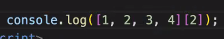

    3. 또한 배열은 위와 같이 생성과 동시에 값에 접근이 가능하다.

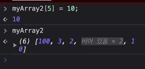

    4. 배열은 위와 같이 비어있는 인덱스를 만들어줄수도 있는데 이를 희소배열이라 부른다.

## 1-2. 배열 값 변경

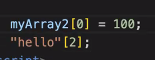

    배열은 위와같이 인덱스로 접근하여 안의 값을 바꾸는 것이 가능하다.
    (배열안에 존재하지 않는 인덱스에도 접근이 가능하나 그럴 경우 undefined를 반환.)

    우리가 배운 것 중에 string또한 인덱스로 접근할 수 있는데 이 둘의 차이점은
    string의 경우 배열과 같이 값을 변경하는 것이 불가능 하다.

    즉, 문자열은 원시타입으로 불변성을 가지고 있어 변하지 않는다.

## 2. 배열의 특징

    1. 요소의 값을 수정할 수 있고 인덱스로 요소의 값을 호출할 수 있다.

    2. JS의 배열은 배열타입으로 존재하지 않고 객체타입으로 존재한다.
    따라서 자료구조에 나오는 엄밀한 의미인 '메모리 상의 연속 배치의 나열'이 아님.

    3. 값의 참조가 인덱스로 이루어진다.
    이는 일반적인 객체와의 가장 큰차이인데, 인덱스와 length 프로퍼티가 존재한다.

## 3. 프로퍼티 length

    프로퍼티는 단순한 속성값을 출력하고 메소드는 배열에 속한 기능 단위를 일컫는다.

    console.dir(변수명) 으로 배열의 프로퍼티와 메서드를 출력할 수 있다.

    length프로퍼티는 요소의 갯수를 구하고싶을 때에 사용하며
    일반적인 객체에는 없는 프로퍼티이다.

# 2. 배열의 여러가지 메소드들

    메소드는 기능단위를 말하는데 console.dir로 출력했을 때
    각각의 메소드 이름뒤에 f라고 표시된 것을 확인할 수 있다.


    메소드는 자료형에 포함된 함수이지만 전역함수와 구분하기 위해
    함수라고 말하지 않고 (빌트인)메소드라고 일컫는다.

    또한 메소드는 원본 배열을 수정하는 메소드와 그렇지 않는 배열이 있기 때문에
    구분하여 사용하도록 한다.

## 1. Array.메소드와 Array.prototype.메소드의 차이

    1. prototype이 안붙은 애들은 Array라는 키워드를 그대로 사용해야 함.

    ex ) Array.isArray(), Array.of() 와 같이 사용

    2. prototype이 붙은 애들은 Array라는 키워드를 그대로 사용할 필요가 없음.

    ex ) myArr.length, myArr.sort() 와 같이 사용

    따라서 우리가 오늘 배운, 정리할 대부분의 메소드는 prototype에 속한다.

## 2. unshift()

    Array.prototype.unshift() 메소드는 배열의 맨 앞에 1개 이상의 요소를 추가하고,
    배열의 새로운 길이를 반환할 수 있다.

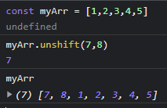

    위와 같이 unshift()를 사용해 myArr에 새로운 요소를 추가하면 기본적으로 새로운 길이
    7을 반환하고 다시 myArr를 출력해보면 7,8이 맨 앞에 추가 된 것을 확인할 수 있다.

## 3. shift()

    Array.prototype.shift() 메소드는 배열내에서 0번째 인덱스에 오는
    첫 번째 요소를 제거해 나머지 값의 위치를 한 칸씩 앞으로 오게끔 만든다.

    매개변수가 없으며 제거된 첫 번째 요소를 반환할 수 있다는 특징이 있다.

    빈 배열에서 사용하거나 배열의 length가 0일 경우 undefined를 반환한다.

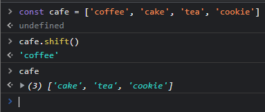

    위와 같이 제거된 첫 번째 요소를 반환한다.

## 4. push()

    Array.prototype.push() 메소드는 배열의 맨 끝에 1개 이상의 요소를 추가하고,
    배열의 새로운 길이를 반환할 수 있다.

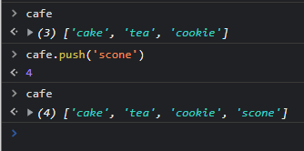

    위와 같이 push로 추가된 scone을 포함한 length를 반환한다.

## 5. slice()

    Array.prototype.slice() 메소드는 원본을 변경하지 않는 메소드이며,
    원본 배열 요소의 얕은 복사본을 반환한다.

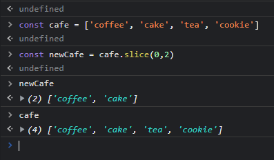

    위와 같이 원본을 변경하지 않고 새로운 배열을 만들 수 있다.

    첫 번째 매개변수는 잘라낼 배열의 시작점의 인덱스를 의미한다.
    첫 번째 매개변수가 undefined인 경우에는 0번 인덱스부터 slice() 메소드가 사용된다.

    첫 번째 매개변수가 해당 배열 길이보다 큰 경우 빈 배열을 반환한다.

    두 번째 매개변수는 잘라낼 배열의 종료지점 인덱스이며,
    잘라낼 배열에 포함되지 않음.

    위의 예제에서 보면 slice(0,2)일 때 0번째에서 2번째 요소까지 출력되는 것이 아닌
    0번째에서 두 번째 요소까지만 출력이 되는 것을 확인할 수 있다.

    두 번째 매개변수에 음수를 입력하면 배열의 끝에서부터 인덱스를 세어 -n번째까지 잘라낸 뒤
    남은 배열을 반환한다.

    또한 두 번째 매개변수를 생략할 시 slice() 메소드는 첫 번째 매개변수부터
    배열의 마지막 요소까지 추출한다.

## 6. reverse()

    Array.prototype.reverse() 메소드는 배열 내 요소의 순서를 거꾸로 뒤집고
    마지막 위치에 있는 인덱스의 요소가 0번째 위치에 오게된다.

    해당메소드는 원본 배열을 변형시키고 그 참조를 반환한다.

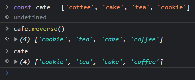

    위와 같이 변형시킨 후 참조를 반환한다.

## 7. indexOf()

    Array.prototype.indexOf() 메소드는 배열에서 지정한 요소를 찾아 해당 요소의
    인덱스를 탐색한다.

    배열에 존재하지 않는 요소를 찾거나 해당 인덱스에서 지정된 요소가 탐색되지 않으면
    -1을 출력한다.

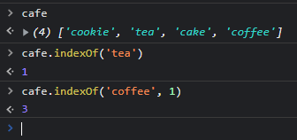

    위와 같이 indexOf를 사용하면 원하는 요소의 index를 반환한다.
    두 번째 매개변수에는 탐색을 시작하고자 하는 인덱스를 입력하며 생략가능.

    위의 예제는 'coffee'를 찾을건데 첫 번째 인덱스부터 검색해서 찾아라 라는 뜻.

    indexOf는 왼쪽에서부터 반환을 하는데 가령 똑같은 인덱스가 여러개 있다면
    가장 처음 만난 인덱스 번호를 반환한 뒤 종료한다.

## 8. join()

    Array.prototype.join() 메소드는 배열 내 원소들을 연결해 하나의 값으로 만들며,
    그 값의 자료형은 문자열이다.

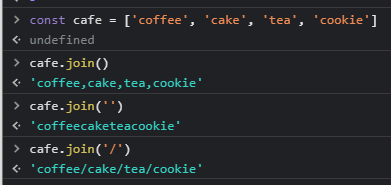

    위의 예제와 같이 매개변수를 생략하면 쉼표로 구분, 빈 문자열을 넣을시 띄쓰기 없이 연결,
    매개변수 안에 문자를 넣으면 그 문자를 각 아이템 사이에 넣어서 반환.

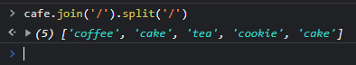

    위의 예제에서 메소드들이 줄지어 있는 것을 확인할 수 있다.
    이러한 것을 메소드 체이닝이라 하며, 메소드 체이닝은 위와 같이 여러개의 메소드들이
    줄지어 있는 것을 말한다.

    메소드 체이닝이 가능한 이유는 반환 값이 메소드를 가지고 있어서이다.
    즉, 위의 예제에서 join으로 반환 된 값이 string이므로 string의 메서드인 split을
    사용할 수 있는 것이다.

    따라서 반환값이 존재하지 않는 메서드는 메서드 체이닝이 불가능하다.

## 9. inlcudes()

    Array.prototype.includes() 메소드는 배열이 특정 값이 포함되어 있는지 확인 가능
    탐색하려는 요소가 문자열일 경우에는 대소문자를 구분한다.

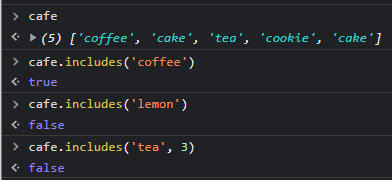

    첫 번째 매개변수에는 탐색하고자 하는 요소를 입력한다.

    두 번째 매개변수에는 탐색을 시작하고자 하는 인덱스를 입력한다. (방식은 indexOf와 동일)
    생략이 가능하며, 값이 없는 경우에는 전체 요소를 대상으로 탐색.

    위의 예제는 'tea' 를 찾을건데 3번째 인덱스부터 찾아줘 라는 뜻이며 3번째 인덱스 뒤에는
    'tea'가 없으므로 false를 반환.

## 10. find()

    Array.prototype.find() 메소드는 배열에서 특정 조건에 부합하는 1개의 값을 찾아 반환.
    filter() 메서드와 문법이 유사하지만, 단 하나의 요소 만을 찾는다는 점이 다르다.

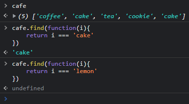

    위의 예제에서 배열에 'cake' 가 두 개가 들어있는 것을 볼 수 있는데 find() 메서드를 이용해
    'cake' 를 찾아주면 하나라도 만족하는 값이 나오게 되면 거기서 종료되는 것을 알 수 있다.

    또한 특정조건에 부합하지 않는다면 undefined를 반환한다.

## 11. filter()

    Array.prototype.filter() 메소드는 배열에서 특정 조건에 부합하는 값을 찾고,
    그 값들로 이루어진 새로운 배열을 만들어 출력한다.

    특정 조건에 부합하지 못한다면 빈 배열을 반환.

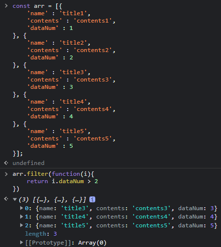

    위와 같이 dataNum이 2보다 큰 조건에 만족하는 모든 요소들을 새로운 배열로 만들어 반환한다.
    즉, 원본에 영향을 미치지 않음.

    앞서 말했듯 filter() 와 find() 의 차이점은 만족하는 모든 요소를 찾느냐, 하나의 값만 찾느냐
    의 차이이다.

## 12. map()

    Array.prototype.map() 메소드는 배열 내에 있는 요소에 오름차순으로 접근 후
    주어진 함수를 호출한 결과를 모아 새로운 배열을 반환한다.

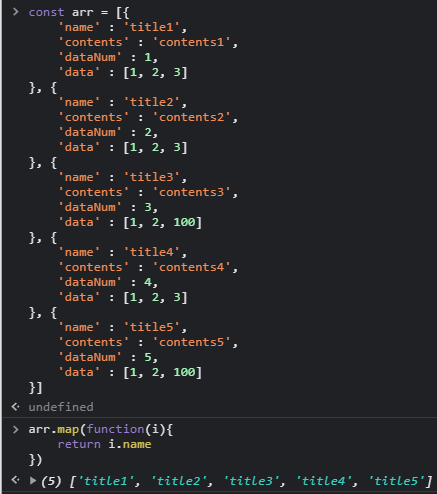

    위와 같이 내가 원하는 값만 뽑아내어 새로운 배열을 생성한다.

    filter() 와 비슷하지만 다른점은 둘은 메서드의 목적 자체가 다르다는 것이다.
    filter또한 새로운 배열을 뽑긴하지만 조건을 제시하여 새로운 배열을 생성하는 것이고,
    map은 원하는 값만 뽑아내어 새로운 배열을 생성하는 것이다.

    중요한 차이점은 조건이 있고 없고의 차이라는 것이다.

    filter는 조건 메소드가 자체적으로 있고 map은 따로없다 그러나 map은 함수자리에 조건문을 쓰면
    메소드와 같이 사용가능하긴 하다.

    따라서 목적에 맞게 map은 요소의 '맵핑', filter는 요소의 '여과' 할 때 사용하도록 하자.

    참고로 배열의 메서드에서 i가 들어가는 메서드들은 배열에 있는 원소들을 하나씩
    순환하는 것이다.

## 13. forEach()

    Array.prototype.forEach() 메서드는 배열의 각 요소에 콜백을 1회씩 실행하여
    희소 배열과 같이 초기화 및 삭제되지 않은 인덱스 속성에 대해서는 실행하지 않음.

    forEach()는 순회한 후 결과값만 반환해준다.

    map은 결과값들을 모아서 새로운 배열로 반환함.

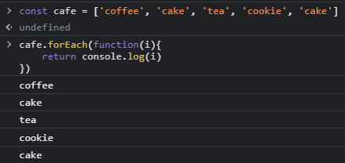

    위와 같이 하나씩 순회한후 결과값만 반환해준다.

## 14. sort()

    Array.prototype.sort() 메서드는 유니코드 코드 포인트에 의해 배열 내 요소를
    오름차순으로 정렬하는데 이 과정에서 요소를 문자열로 취급해 재정렬하며, 배열자체를 변경한다.

    즉, number또한 문자열로 취급해 재정렬 하는데 이 때 문제가 발생하는데

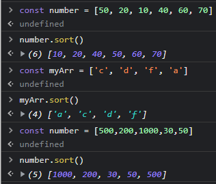

    위의 예제에서 보면 10의 자리인 number가 모인 배열의 경우 오름차순으로
    이쁘게 정렬된 것을 알 수 있고,

    문자열 또한 알파벳순으로 정렬 된 것을 볼 수 있다.

    그러나 자릿수가 다른 number들이 모인 배열의 경우 문자열로 취급하여 유니코드
    에 의해 정렬이 되므로 우리가 원하는 오름차순으로 정렬이 되지 않는 것을
    볼 수 있다.

    이를 해결해주기 위해 compare function을 사용하면 된다.

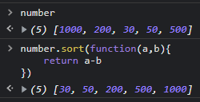

    위와 같은 함수를 compare function이라고 하는데 작동 원리가 무엇일까?

## 15. compare function

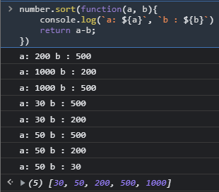

    compare function의 작동원리를 보기위해 위와 같이 console.log를 통해
    a와 b가 어떤식으로 반환이 되는지 출력 해보았다.

```js
const number = [500, 200, 1000, 30, 50];

// 200 - 500 ==>음수 [200,500,1000,30,50]
// 1000 - 200 ==> 양수 [200,500,1000,30,50]
// 1000 - 500 ==> 양수 [200,500,1000,30,50]
// 30 - 500 ==> 음수 [200,30,1000,500,50]
// 30 - 200 ==> 음수 [30,200,1000,500,50]
// 50 - 500 ==> 음수 [30,200,1000,50,500]
// 50 - 200 ==> 음수 [30,50,200,500,1000]
```

    위와 같은 프로세스를 거치는데 정리하자면 음수가 나오면 Js가 자리를 바꿔주고
    양수가 나오면 자리는 그대로 인것이다.

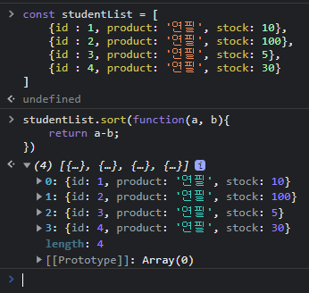

    위의 예제에서는 배열안의 요소가 숫자가 아닌 다른값이 들어간 경우라
    필기한 내용대로 compare funtion을 사용해주면 제대로 출력되지 않는다.

    이를 해결해주기 위해

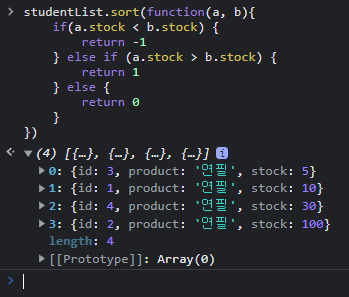

    위와 같이 if문에 조건식을 달아 정렬 해줄 수 있다.

    위의 if문을 해석해보자면 a.stock이 b보다 작은 경우는 음수이기 때문에
    -1을 반환한다 -1을 반환하면 음수니까 js에서 자리를 바꿔준다.

    a.stock 이 b보다 큰 경우는 양수인 경우이므로 1을 반환해 그자리에 그대로 둔다.

    마지막으로 0인경우를 확인하여 0을 반환한다.

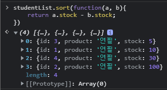

    위와 같이 직관적으로 비교도 가능하긴하다.

    a.stock 에서 b.stock을 뺀 값을 리턴하면 첫 번째 예제와 똑같은 프로세스를 거쳐
    값이 정렬된다.
