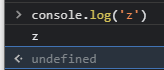
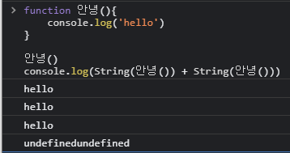

# 함수

    함수를 사용하는 이유는 뭘까?

    1. 재사용성
    2. 유지보수
    3. 구조파악이 용이하다.

    크게 위와같은 세가지 이유로 정리할 수 있겠다.

    예를들어

    땅파기() // 10만줄
    땅파기() // 10만줄
    땅파기() // 10만줄
    땅파기() // 10만줄
    기반다지기() // 10만줄
    기둥세우기() // 10만줄
    벽돌쌓기() // 10만줄
    지붕올리기() // 10만줄

    위와 같은 코드가 있다고 해보자 위의 코드를 보면 누가봐도 집을 짓기위한 코드라는 것을 알 수 있다.
    즉, 구조파악이 용이하다는 것이다.

    또한 위의 경우처럼 땅파기를 여러줄 추가하여 10만줄의 코드를 단 한줄의 코드로 대체할 수 있으므로
    재사용성이 뛰어나다는 점이다.

    또한 땅파기() 라는 함수를 쓰지않고 땅파기라는 코드가 40만줄이 있다고 생각해보자
    그렇게 된다면 유지보수가 굉장히 불편할 수 있다. 아니 사실상 불가능에 가깝다고 봐도 될 정도다

    그러나 함수를 사용하면 위와 같이 땅파기() 라는 함수를 찾아 그 함수만 고쳐주면 되므로
    유지보수가 탁월하다는 장점이 있다.

    위와 같은 이유로 우리는 함수를 사용하는 것이라고 볼 수 있다.

## 1. 함수의 구조

    기본적인 함수의 구조는

```js
function 안녕(파라미터) {
    console.log(파라미터);
    console.log('hello world');
    return 100;
}

let 아규먼트 = 1000;
안녕(아규먼트);
```

    위와 같은 형태를 뛰며 사용을 할 땐 안녕(아규먼트) 라고 해주는데 여기서 파라미터는
    선언할 때 아규먼트는 실제로 사용할 때로 구분지어 사용하며 파선아실로 기억하도록 하자.

    또한 위의 코드를 콘솔창에 찍었을 때 return 값 100이 출력이 되는데
    실제로 return 100을 적어 출력을 해줬다기 보다는 그저 브라우저의 기능으로써
    마지막으로 return 값을 출력해 준것 뿐이다.

## 2. 함수의 return

    return 명령문은 함수 실행을 종료하고, 주어진 값을 함수 호출 지점으로 반환.

    return 을 적지 않으면 undefined가 기본값이며, return을 적고 값을 할당해주지
    않아도 undefined이다.



    또한 위와 같이 console.log를 찍었을 때 undefined가 출력되는 이유는
    console.log 또한 함수이며 return값이 없기 때문에 마지막에 undefined를
    반환하는 것이다.
    즉, console.log의 return 값은 undefined 이다!



    위의 예를 보면 알 수 있는데 return값을 적어주지 않았기 때문에
    안녕() 을 string으로 바꾼 undefined가 두번 더해져 undefinedundefined가
    출력되는 것이다.

---

    또한 return값은

```js
function 안녕() {
    console.log('hello');
    console.log('hello');
    console.log('hello');
    return;
    console.log('hello');
    console.log('hello');
    console.log('hello');
}

안녕();
```

    위와 같은 경우 return값이 실행 된 순간 밑의 코드들은 무시하고 함수를 종료해버린다.

    또한 return값에 아무것도 넣어주지 않아 undefined가 되므로 마지막에는
    undefined가 출력이 된다.

## 3. 참고

```js
function sum(a, b) {
    return a * b;
}

console.log(sum(10, 20));
```

    위와 같이 sum이라 해놓고 return값을 곱해주는 저런 알아보기 힘든
    함수 작성은 피하도록 하자.

# 함수의 다양한 형태

    함수의 다양한 형태에 대해 알아보도록 하겠습니다.

## 1. 함수의 아규먼트에 따른 반환값

```js
function 함수1(a, b, c) {
    return a + b + c;
}

함수1(10, 20, 30);
함수1(10, 20, 50);
```

    위의 예제를 그대로 콘솔창에 출력해보면 80만 출력되는 것을 확인할 수 있다.
    그 이유는 앞서 설명한 이유와 똑같이 console.log를 찍지는 않았지만
    마지막 라인에 한하여 console.log를 찍지 않아도 return값을
    console창에 출력해주는 것이다.

## 2. 필요 이상의 아규먼트를 넣었을 때

```js
function 함수1(a, b, c) {
    return a + b + c;
}

함수1(10, 20, 30, 40);
```

    필요 이상의 아규먼트를 넣는다고 해도 js에서는 error를 뿜지않고

    앞의 10,20,30 을 더한 값을 출력해준다.

## 3. 필요 이하의 아규먼트를 넣었을 때

```js
function 함수1(a, b, c) {
    return a + b + c;
}

함수1(10, 20);
```

    위의 예제에서 우리는 필요 이하의 아규먼트를 넣었다.
    이렇게 되면 NaN이 출력이 되는데 그 이유는 c의 값이 정해지지않아
    undefined가 되기 때문이다.

    즉, 10 + 20 + undefined 가 되어버려 NaN이 출력되는 것이다.

```js
function 함수1(a, b, c) {
    return a + b + String(c);
}
```

    예제의 c를 위와같이 바꾸어 출력해보면 '30undefined' 가 출력됨.

## 3. 구조분해할당을 이용한 아규먼트 처리

```js
function 함수2(a, b, ...c) {
    console.log(c);
    return Math.max(...c);
}

함수2('hello', 'world', 10, 20, 30, 40);
```

    위의 예제에서 구조분해할당을 이용해 아규먼트를 처리해주었다

    실제로 console창에 출력을 해보면 a자리에는 'hello' , b자리에는 'world'
    가 들어가고 그 후 나오는 모든 아규먼트가 ...c로 처리된 c에 전부 들어가게 된다.

    만약 스프레드 용법을 사용하지 않고 c만 적어주게 되면 순서에따라 10만
    c에 들어가 값은 hello world 10 이 출력이 된다.

```js
function 함수2([a, b], ...c) {
    console.log(a);
    console.log(b);
    console.log(c);
}

함수2([1, 2], 10, 20, 30, 40);
```

    위의 예제에서 또한 구조분해할당을 이용하여 아규먼트를 처리해주었는데
    여기서 아규먼트와 파라미터의 형태가 같아야한다는 점을 잊지말자.

    형태가 다르다면 error를 출력하며 형태는 같지만 필요이하의 아규먼트를 입력해주게되면

    undefined를 출력한다.

## 4. 기본값 할당

```js
function 함수3(a = 10, b = 20, c = 30) {
    return a + b + c;
}

console.log(함수3()); // 60
console.log(함수3(100)); // 150
console.log(함수3(100, 200)); // 330
console.log(함수3(100, 200, 300)); // 600
```

    함수에서는 위의 예제와 같이 기본값을 할당해줄 수 있다.

    예제에서와 같이 기본값을 할당해주게 되면 값을 적어주지 않아도
    60을 return하는 것을 볼 수 있다.

    100을 적었을땐 150을, 100과200을 적었을땐 330을 모두 적었을땐 적은 값들을
    다 더해주는 것을 알 수 있다.

    이루 미루어 보았을 때 기본값을 설정해주면 들어온 값이 있다면
    그 값으로 대체, 값이 없다면 기본값으로 대체하여 결과값을 return한다.

---

    함수3(c=1000)

    그렇다면 위와같이 함수를 사용하게 되면 어떻게 될까?
    눈에 보이는대로만 예상해본다면 1030이 출력되어야 맞지 않냐?
    라고 생각할 수 있지만,

    아규먼트 자리에 c=1000이라고 해주어도 실제 값에는 변화가 없고
    그저 아규먼트의 1000이라는 값이 a부터 순서대로 들어간다.

    따라서 1050이 출력이 되는 것이다.

## 5. 함수에서 객체를 아규먼트로 전달받는 방법

```js
function 함수4(회원등급, 글쓰기, 글읽기, 채널관리, 백업, 소셜로그인여부) {
    // 회원 등급 권한
    console.log('함수기능');
    return;
}

함수4('Gold', true, true, true, '대화방 전체 백업 가능', true);
```

    위와 같은 예제가 있다.

    예제를 보면 함수4에 파라미터에 맞게 아규먼트를 입력해주었는데
    지금 우리가 보기에는 true가 각각 어디에 대응되는지 잘 보인다.

    그러나 실제코드는 뎁스가 매우 깊어 true가 뭔지 찾기위해
    함수4로 찾아가야하는 번거로움이 생기며 가독성이 떨어진다.

```js
function 함수4({ 회원등급, 글쓰기, 글읽기, 채널관리, 백업, 소셜로그인여부 }) {
    // 회원 등급 권한
    console.log('함수기능');
    console.log(회원등급, 글쓰기, 글읽기, 채널관리, 백업, 소셜로그인여부);
    return;
}

함수4({
    회원등급: 'Gold',
    글쓰기: true,
    글읽기: true,
    채널관리: false,
    백업: '부분가능',
    소셜로그인여부: true,
});
```

    따라서 위와 같이 객체를 사용해 아규먼트로 전달을 받을 수 있는데
    이렇게 되면 함수4에서 사용한 아규먼트들이 직관적으로 눈에들어오고
    가독성이 좋아진다.

    또한 위의 예제에서 가령 글쓰기의 값을 입력해주지 않는다면
    undefined가 출력이 된다.

## 5-1. 초깃값 설정

    입력이 되지 않았을 때 undefined가 출력이 되는 것을 막기위해

```js
function 함수4({
    회원등급 = 'Gold',
    글쓰기 = true,
    글읽기 = true,
    채널관리 = true,
    백업 = '부분가능',
    소셜로그인여부 = true,
}) {
    console.log('함수기능');
    console.log(회원등급, 글쓰기, 글읽기, 채널관리, 백업, 소셜로그인여부);
    return;
}

함수4({
    회원등급: 'Gold',
    채널관리: false,
    백업: '부분가능',
    소셜로그인여부: true,
});
```

    위와 같이 초깃값을 설정을 해주면 입력을 하지 않아도 입력하지 않은 부분들은
    초깃값으로 대체되어 undefined가 출력이 되지 않게 된다.

## 6. 재귀함수

    재귀함수는 내가 나를 호출하는 함수이다.
    또한 재귀함수로 구현이 가능한 것은 반복문으로도 구현이 가능하다.

    주로 반복문은 바텀업, 재귀함수는 탑다운 형식으로 사용된다.

    ------------- 재귀함수는 추후에 다시 다루겠습니다 ---------------

## 7. 지역변수와 전역변수

    전역이란? 코드의 가장 바깥영역을 말하고 이 영역에 선언된 변수는
    전역 스코프를 갖는 "전역변수" 가 된다.
    즉, 전역 변수는 어디서든지 참조할 수 있는 변수이다.

    지역이란? 함수 몸체 내부를 말하고, 이 영역에 선언된 변수는
    지역 스코프를 갖는 "지역변수"가 된다.
    즉, 지역 변수는 자신의 지역스코프와 하위 지역 스코프까지 유효하다.

```js
if (true) {
    // for문이어도 마찬가지.
    let x = 10;
    const y = 10;
}
console.log(x, y); // 출력 안됨

// 밖에 선언된 x는 함수 내부에서도 접근 가능합니다.
let x = 100;
function xplus() {
    x += 10;
}
```

    위의 예제를 살펴보자 첫번째 예제의 경우 x는 지역변수라고 할 수 있다.
    함수 내에서 선언된 변수이므로 외부에서 접근이 불가능하다.
    또한 함수가 종료된 후에는 선언된 변수는 휘발되기 때문에 외부에서 접근이
    불가능한 것이다.

    두번째 예제의 경우 밖에 선언된 변수x가있다 이 변수의 경우
    전역 변수가 되며 함수 내부에서도 접근이 가능하다.
