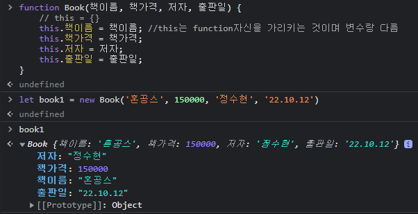

# 생성자 함수

    생성자 함수를 사용하는 이유는 동일한 프로퍼티를 가지는 객체를 생성하기 위해서이다.
    또한 prototype을 이용하여 메모리 절감을 위해서도 필요.

## 생성자 함수의 형태

    1. 생성자 명은 반드시 대문자로 시작한다. (일반 함수와의 구별을 위하여)
    2. "this.프로퍼티" 를 통해서 프로퍼티 명시만 가능.

```js
function Book(책이름, 책가격, 저자, 출판일) {
    // this = {}
    this.책이름 = 책이름; //this는 function자신을 가리키는 것이며 변수랑 다름
    this.책가격 = 책가격;
    this.저자 = 저자;
    this.출판일 = 출판일;
    // return
```

    this. 뒤에 붙은 값들이 키가 되고 = 할당된 값들은 Book의 매개변수와 똑같이 써준다.

    위와 같은 형태를 띄고 있으며 this의 경우 function자신을 가리키는 것이며 변수랑은 다르다.

    function자신을 가리킨다는 말은 Book이라는 자기 자신을 가리키는 것이다.



    생성자 함수를 사용하기 위해서는 반드시 new라는 키워드를 사용해야하며,
    new 라는 키워드안에는 주석처리 된 this = {}, return this 가 포함되기 때문에 return값이 없어도
    return을 this값을 return 해주게 되는 것이다.

    new라는 키워드를 붙이지않고 Book()으로 호출하여 사용하면 undefined가 출력 된다.

    또한 생성자 함수는 객체를 찍어내는 용도(붕어빵 틀과 비슷)로 사용가능하다.

# 콜백 함수

    callback function 이란? 나중에 부르는 함수를 일컫는 말이며, 매개변수로 전달하는 함수를 말함.

```js
function sum(x, y, 콜백함수자리) {
    // 콜백함수를 넣을 수 있는 곳을 하나 더 마련
    콜백함수자리(x + y);
    return x + y;
}

function documentWriter(s) {
    console.log('콜백함수', s);
}

sum(10, 20, documentWriter);
```

    위의 예제를 통해 콜백함수가 어떻게 작동하는지 알아보자.

    우선 위에서 보면 sum이라는 함수의 파라미터에는 x,y,콜백함수자리가 들어있고
    두번째 documentWriter함수의 파라미터에는 s가 들어가있습니다.

    콜백함수를 사용하기 위해 콜백함수자리 라는 파라미터를 마련해놨습니다.

    sum(10, 20, documentWriter)으로 sum함수를 호출하게 되면

```js
function sum(10, 20, documentWriter) {
    // 콜백함수를 넣을 수 있는 곳을 하나 더 마련
    documentWriter(10 + 20);
    return 10 + 20;
}
```

    위와 같이 값들이 들어가게 됩니다.

    그 후에 sum함수 안에있는 documentWriter()함수를 호출합니다 그러면
    documentWriter함수에 있는 console,log가 순서에따라 찍히게 되고 그 후에
    sum함수의 return값이 반환이 됩니다.

    우리의 예제에서 콜백함수는 위와같은 순서로 작동을 합니다.

    그래서 sum함수를 호출할 때를 잘 보면 함수이름을 마치 아규먼트로 전달하여
    함수 어딘가에서 호출을 하는 것을 콜백함수라고 합니다.

```js
let arr = [10, 20, 30, 40, 50];
arr.map(제곱); //map 은 새로운 array를 만듦

function 제곱(x) {
    return x ** 2;
}

arr.map((x) => x ** 2); // 위의 함수와 이 화살표 함수는 같습니다.
```

    위의 예제또한 콜백함수이다 잘보면 map의 아규먼트에 함수 제곱이 들어가있어서
    함수 이름을 아규먼트로 전달해주었다.

    이렇게 되면 arr.map을 해줄건데 제곱이라는 함수로 실행을 해준다는 의미이며
    제곱이라는 함수는 x의값을 제곱한다음 리턴해주기 때문에
    최종적으로 새로운 array [100,400,900,1600,2500] 이 반환된다.
