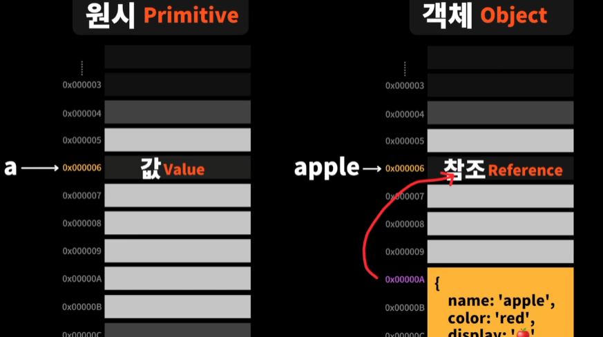
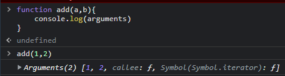
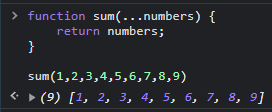

# 값과 참조의 차이



    위의 이미지와 같이 원시타입은 값이 메모리셀에 담기고 변수가 그 메모리 자체를 가리킨다.

    그러나 객체타입은 실제로 객체가 담겨있는 메모리 주소를 보관하고 있는 것이다.

    정리하자면 원시타입은 '값'이 메모리에 담겨있고 객체는 '참조' 즉, 메모리주소가
    Heap에 담겨있는 것이다.

```js
let a = 1;
let b = a; // 1
b = 2;
```

    위의 코드를 콘솔창에 찍어보면 각각 a = 1, b = 2로 원시타입은 값자체가 복사되어 전달
    되기 때문에 b의값을 바꾸더라도 a의값은 바뀌지 않는 것을 볼 수 있다.

    그러나 객체타입은 참조값(메모리주소, 레퍼런스)가 복사되어 전달된다 그렇기 때문에

```js
let apple = {
    // 0x1234
    name: 'apple',
};

let orange = apple;

orange.name = 'orange';
```

    위와 같이 orange를 apple에 할당을 해주면 apple이라는 객체자체가 orange에 전달되는 것이아니라
    객체 주소의 값이 복사되어 전달된다

    위와 같이 예를들어 apple의 주소값이 0x1234라고 한다면 orange에게도 똑같이 0x1234의 주소가 복사되어
    전달된다. 즉, 동일한 객체를 가리키고있는 동일한 주소를 갖게되는것이다.

    따라서 위와같이 오랜지의 이름을 오랜지로 바꾸어준 뒤 apple과 orange를 출력해보면 둘 다 같은 객체를
    가리키며 같은 주소를 갖고있기 떄문에 값이 둘 다 바뀌어버리는 것이다.

    객체타입의 주소값이 복사되어 전달되는 경우는 객체의 경우 굉장히 긴 코드로 작성된다면 값이 너무 많아져
    그 값자체가 전달될 수 없기 떄문이다.

# 함수

## 함수와 메모리

```js
function add(a, b) {
    return a + b;
}

const sum = add;
```

    위와 같이 함수를 작성한 뒤 sum에 add함수를 할당해주면 앞에서 객체타입의 주소값이 복사된 것처럼
    함수또한 주소값이 복사되어 저장이 된다(함수또한 객체이기 떄문). 즉, sum도 add 주소값을 가리키고 있는 것이다.

    따라서 sum이라는 변수가 add 함수를 가리키고 있기 때문에 sum또한 add처럼 sum(1,2) 처럼 사용이 가능하다.

## return

    함수상에서 return을 명시적으로 적어주지 않으면 function은 return의 default값인 undefined를 출력한다.

```js
function sum(a, b) {
    return a + b; // >> return을 명시적으로 적어줌
}

function sum(a, b) {} // >> 이 함수와 같이 return을 적어주지 않으면 return undefined와 똑같음.
```

    위의 예제를 정리하자면 return을 명시적으로 하지 않으면 자동으로 undefined가 반환된다 는 것을 알 수 있다.

    주로 무언가 print만 하고 동작을 멈추는 함수의 경우 return을 생략한다.
    즉 return을 생략하는 함수는 어떤 값을 반환하는 것이 아니라 그냥 특정한 일을 수행하는 함수인 것이다.

    또한 return은 함수 중간에 하게되면 함수가 종료된다.
    사용하는 예는 조건이 맞지 않는 경우 함수 도입부분에서 return을 명시해주어 함수를 일찍 종료시켜버릴 수 있다.

## arguments



    위의 이미지처럼 함수에는 arguments라는 객체가 있는데 배열에 접근하는 것 처럼 접근할 수 있다.

    이를 정리해보자면 매개변수의 정보는 함수 내부에서 접근이 가능한 arguments라는 객체에 저장이 된다
    라는 사실을 알 수 있다.

## Rest Parameters

```js
function sum(...numbers) {
    return numbers;
}
```

    위와 같이 내가 매개변수로 얼마나 많은 정보를 받을지 모르겠다.

    라고할 때 스프레드용법을 이용하여 받는 매개변수를 모두 배열로 반환할 수 있다.



## 함수 표현식

    let add = function(){} >> 과 같이 함수를 선언해주는 것을 함수 표현식 이라한다.
    일반적으로 함수를 작성할 때 쓰는 것은 함수 선언문!

    함수 표현식이 가능한 이유는 함수도 객체이기 때문이다.

    위와 같이 표현식으로 작성하는 경우 함수의 이름을 써주지 않는 것이 좋다.

    위의 함수의 경우 add라는 이름을 사용하여 호출하도록 한다.

## 화살표 함수

    add = (a,b) => a+b >> 와 같이 값만 표현하는 함수의 경우 괄호를 생략하고 return도 생략이 가능하다.

## 콜백 함수

```js
function test(a, 콜백) {
    console.log(a);
    console.log(콜백());
}

function 나는야콜백() {
    console.log('나는야콜백함수');
}

test('반갑다', 나는야콜백);
```

    위의 예제는 콜백함수의 예제이다.

    왜 콜백함수일까? test에서 두번째 파라미터는 콜백이라는 함수를 인자로 받고있다.

    이거 자체가 콜백함수인 것인데, 콜백이라는 함수를 바로 사용하지않고 인자로 받았을 때 사용을 하기때문에
    콜백함수라 하는것이다.

    나중에 쓸테니 기다려!

    또한 위에서 나는야콜백 함수를 test의 인자로 전달해줄 때 호출을 하지않고 이름만 전달했음으로
    나는야콜백의 참조값(주소값)을 전달하는 것이다.
