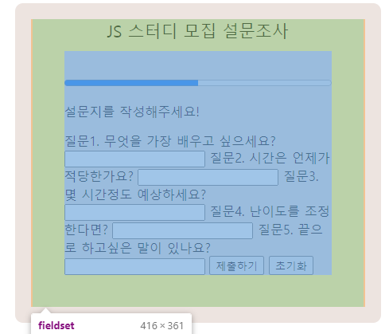
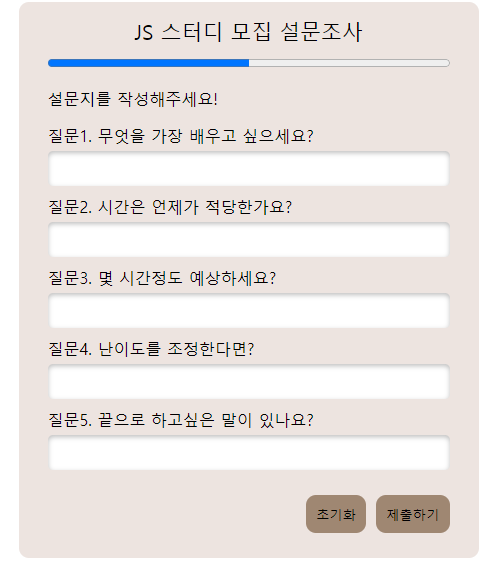

# HTML 추가지식

## legend

    legend태그는 필드셋의 패딩을 무시한다.



    위의 이미지와 같이 패딩이 무시되는 것을 볼 수 있다.

    정확한 이유는 알 수 없지만 추측으로는 legend는 제목으로 분류가 되어 padding이 무시가 되는 것 같다.

    또한 예외적으로 text-align이 적용이 된다.

## fieldset BFC

    fieldset 태그는 예외적으로 float된 자식을 알아볼 수 있는데 그 이유는 fieldset태그 자체가
    BFC 즉, 블록 포멧팅 컨텍스틀 생성하기 때문이다.

## progress

    progress 태그는 얼마나 진행되었는지를 눈으로 볼 수 있는 상태바를 제공해준다.

    속성으로는 max가 있으며 min은 존재하지 않는다 max가 100이라고 했을 때 value가 50이라면
    상태바가 50% 차있는 모습을 볼 수 있다.

# CSS 추가지식

## input:valid

    input:valid => input안에 적용한 값이 유효한지 아닌지를 판단하여 CSS속성을 적용시킴.
    input의 속성에 required를 적어줘야함.

    ex) input의 속성이 email이라고 가정했을 때 단순히 텍스트만 입력한다고 하면 valid가 적용되지않음
    왜냐면 email은 @와 주소가 들어가야 유효한 것으로 처리하기 때문이다.

    정리하자면 input의 type에따라 값이 유효하다면 코드를 실행시켜줘 라는 의미이다.

## box-shadow 의 inset

    box-shadow에서 마지막에 inset을 추가하면 그림자가 외부에서 내부로 생성된다.

# JS DOM

## event keyup

    keyup event는 키보드에서 키를 뗐을 때 발생하는 event이다.



    위의 설문조사에서 처음으로 적용할 js 효과는 전체 form태그에 대한 keyup event이다.

    keyup event가 발생했을 때 먼저 값이 입력된 유효한 input의 개수를 저장할 변수를 선언해준다.

```js
mainForm.addEventListener('keyup', () => {
    // 유효한 인풋의 개수를 저장함
    let validCounter = 0;

    inputs.forEach((item) => {
        // 요소안의 값이 유효한지 아닌지 검사 validity
        // console.log(item.validity);
        if (item.validity.valid) {
            validCounter++;
        }
});
```

    위와 같이 유효한 인풋의 개수를 저장하는 validCounter 변수를 지정해준 뒤

    inputs(nodelist임)에 forEach를 통해 순회를 도는데 이때 validity는 요소안의 값이 유효한지 아닌지
    검사를 해준다.

    위에서 주석처리를 해놓은 console.log를 풀어주면 해당되는 input의 갯수에 따라 유효성검사를 해주는데
    만약 값이 들어간 상태 즉, 유효한 상태라면 valid가 true로 출력된다.

    이를 이용해 if의 조건문에 item.validity.valid가 true라면 validCounter에 1을 더해주는 코드를 작성해주었다.

    그렇게 되면 input에 값이 있는 input들만 체크가 되어 값이 누적된다.

    validCounter을 콜백함수에 넣어준 이유는 event가 실행될 때마다 값을 초기화 해주기 위해서이다.

    그렇지 않다면 값은 계속 누적되어 원하는 결과값이 출력되지 않음.

## filter로 해결하기

```js
const result = Array.prototype.filter.call(inputs, (item) => {
    return item.validity.valid;
});
```

    앞선 예제의 코드를 forEach를 사용하지 않고 filter를 통해서도 해결할 수 있는데
    여기서 filter는 배열의 메서드이기때문에 call을 사용해 this값을 바꾸어줄 수 있다.

    즉 nodelist가 배열의 메서드를 빌려와 사용할 수 있게 해주는 것이 call이다.

    또한 filter를 사용하게 되면 값을 누적해주는 코드를 줄여줄 수 있음.

## switch 조건문을 활용해 조건을 나누어주기

```js
switch (validCounter 또는 result.length) {
    case 1:
        message.textContent = '답변 1개 완료';
        proBar.setAttribute('value', 20);
        break;
    case 2:
        message.textContent = '답변 2개 완료';
        proBar.setAttribute('value', 40);
        break;
    case 3:
        message.textContent = '답변 3개 완료';
        proBar.setAttribute('value', 60);
        break;
    case 4:
        message.textContent = '답변 4개 완료';
        proBar.setAttribute('value', 80);
        break;
    case 5:
        message.textContent =
            '모든 질문에 답변을 하셨습니다. 제출하기 버튼을 클릭해주세요!';
        proBar.setAttribute('value', 100);
        break;
    default:
        message.textContent = '설문지를 작성해주세요!';
        proBar.setAttribute('value', 0);
        break;
    }
});
```

    위와 같이 switch 조건문을 활용하여 여러가지 조건문을 처리해주었다.

    validCounter를 자료로 활용하여 case를 5가지로 나누어주었다.

    case를 5가지로 나누어주었기 때문에 질문에 대한 답변을 하나씩 할때마다 해당되는 case가 실행이 된다.

    또한 default를 적용해주어 모든 값이 유효하지 않을 때에는 즉, validCounter가 0일때의 경우도 설정해주었다.

    또한 위에서 filter를 활용한 예제를 사용한다면 자료로 result.length를 활용할 수 있다.

## reset

    그러나 질문을 작성하다가 "초기화" 버튼을 눌러주면 input안의 값은 사라지나 progress bar와
    p태그에 들어간 text가 그대로 존재하는 상태로 reset이 된다 이를 고쳐주기 위해

```js
btnReset.addEventListener('click', () => {
    message.textContent = '설문지를 작성해주세요!';
    proBar.setAttribute('value', 0);
});
```

    switch 조건문에서 default로 활용했던 식을 그대로 가져와 사용해주었다.
