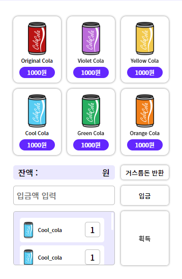
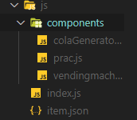

# 밴딩머신 HTML, CSS, JavaScript

## HTML

1. 마크업을 할 때 `li` 태그에 클래스를 넣어주면 모든 `li`마다 클래스를 넣어줘야 합니다.  
   그러나 `ul` 태그에 넣어주면 공통적인 클래스를 가지는 `li` 들을 컨트롤 할 수 있습니다.

2. `button` 태그에 `data` 는 무언가 정보를 저장할 때 쓰는 용도로 사용됩니다.

## CSS

1. `img` 태그에 `display: block` 속성을 주는 이유는 이미지 태그가 가지고 있는 baseline때문인데  
   이 baseline은 `img` 태그가 `display: inline-block` 이기 때문이다.

```css
#app .tit-app {
    position: absolute;
    width: 386px;
    top: 0;
    left: 50%;
    transform: translate(-50%);
}
```

2. 위와 같이 포지션 속성을 활용하여 `left` 와 `trasform` 으로 가운데 정렬을 해줄수도 있다.



3. 위의 이미지를 잘 보면 콜라리스트와 밑의 버튼과 인풋 요소들의 크기가 같은 것을 볼 수 있다.  
   먼저 콜라 리스트들을 `display: grid` 속성을 주어 `grid-template-columns: 1fr 1fr 1fr` 씩 주었다.

여기서 중요한 것은 밑의 요소들도 위의 요소들 2개를 합친 크기가 왼쪽에 있는 요소들 오른쪽에 있는 요소들은

각 `1fr` 씩 공간을 차지하고 있는것으로 보인다.

따라서 밑의 `2fr` 씩 차지하고 있는 것으로 보이는 요소들을 선택하여

```css
.cont-buy .info-balance,
.cont-buy .inp-put,
.cont-buy .list-item-staged {
    /* 2fr 1fr 을 하지 않은 이유는 위에서 grid설정할 때 1fr 1fr 1fr해줬기 때문 */
    grid-column: 1/3;
    border-radius: 5px;
}
```

위와 같이 스타일을 부여해주었다.

주석에 설명되어있다시피 `2fr 1fr` 을 하지 않은 이유는 위에서 grid 설정할 때 `1fr 1fr 1fr` 을 해주었기  
때문에 `2fr 1fr` 을 해주게 되면 크기가 달라지게 된다.

따라서 1번째 그리드 번호부터 3번째 그리드번호 까지 영역을 차지하게 하여 위의 요소들과 자연스럽게  
크기를 맞추어 준다.

4. 버튼을 클릭하였을 때 테두리가 변경되길 원한다면 `hover` 혹은 `active` 시에 `border` 속성을  
   주게 된다면 박스크기에 영향을 미친다.

그러므로 테두리가 변경되길 원한다면 `outline` 속성을 활용하면 크기에 영향을 미치지 않고  
자연스럽게 테두리에 효과를 줄 수 있다.

5. `button` 요소안에 여러가지 태그들이 들어있고 그 태그들에게 `padding` 값을 주게된다면,  
   버튼을 클릭할 수 있는 공간이 그만큼 줄어들게된다.

사용자 관점에서 보았을 때 `button` 자체에 `padding` 을 주어 크기를 늘리게되면 자연스럽게  
클릭할 수 있는 공간 또한 늘어나 더 좋다.

6. `span` 태그와 같이 `display` 가 기본적으로 `inline` 인 태그들은 `text-align: center` 로  
   가운데 정렬을 할 수가 없다.

따라서 `display` 속성을 `block` 으로 바꾸어 텍스트가 움직일 수 있는 여유공간을 확보한 뒤  
`text-align: center` 를 하게 되면 텍스트가 가운데로 움직이게 하는 것이 가능하다.

```css
@media only screen and (min-width: 320px) and (max-width: 480px) and (-webkit-min-device-pixel-ratio: 2) {
    /* 온리는 안전하게 넣는게 좋음 */
    body {
        background-color: #fff;
    }

    #app {
        padding-top: 96px;
    }

    #app .tit-app {
        width: 166px;
    }
}
```

7. 반응형 디자인을 위하여 `@media` 속성을 이용할 때는 `only` 를 넣어주는 것이 안전하다.

---

## JavaScript



위와 같이 밴딩머신의 `JavaScript` 파일들을 분류해주었다.

`import` 를 하여 모듈화 시켜서 작업을 해주기 위해서이다.

여기서 짚고 넘어가야 할 점은 `script type` 이 `module` 이라면 일반 브라우저에서 열듯이 브라우저를  
작동시키면 해당 `js` 파일을 읽지 못합니다.

따라서 라이브서버나 로컬호스트를 사용하여 열도록 합니다.

또한 `type='module'` 을 주는 경우는 모듈화 되어진 js파일을 쓸 때 사용하는 속성입니다.

---

1. 받아온 데이터를 `js`를 통해 화면에 랜더링 해주기 위해서 `json` 파일을 만들어 줍니다.

```js
[
    {
        name: 'Original Cola',
        cost: 1000,
        img: 'Original_Cola.png',
        count: 5,
    },
    {
        name: 'Violet Cola',
        cost: 1000,
        img: 'Violet_Cola.png',
        count: 5,
    },
];
```

위와 같이 `json` 파일을 만들어주었습니다.

적어준 각각의 `key` 들은 나중에 `js` 파일에서 생성한 html 태그로 들어가게 됩니다.

길이때문에 원래 6개지만 2개로 생략하였습니다.

json파일에 들어간 `value` 들은 특히 이미지의 경우 이미지 파일과 이름이 동일해야 합니다.

2. 그 뒤 `colaGenerator.js` 파일에서 콜라를 생산해내는 `class` 를 만들어 줍니다.  
   여기서 `class` 를 생성하고 `index.js` 파일에서 `import` 하여 사용할 예정입니다.

3. `colaGenerator.js` 에서는 `ajax`로 통신하는 방법과 `asnyc`를 이용하여 통시하는 방법  
   두가지로 나누어 사용해보겠습니다.
