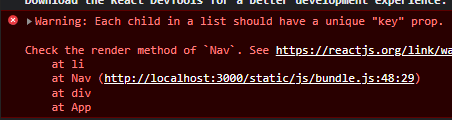

# props

```html

```

위에서 보이는 html의 `img` 태그는 속성을 가지고 있습니다.

그러나 우리가 만든 `컴포넌트` 에는 이러한 속성이 없는데 우리도 이러한 속성을  
가지게 할 수 있습니다.

`React` 에서는 속성을 `PROP` 이라 부르며 우리가 만든 `컴포넌트` 에 `Prop`을  
장착하는 방법을 배워보도록 하겠습니다.

## props 사용하기

```js
function Header(props) {
    return (
        <header>
            <h1>
                <a href='/'>{props.title}</a>
            </h1>
        </header>
    );
}

function App() {
    return (
        <div>
            <Header title='React'></Header>
            <Header title='Html'></Header>
            <Header></Header>
            <Nav></Nav>
            <Article title='Welcome' body='Hello, WEB'></Article>
        </div>
    );
}
```

`컴포넌트`를 만들어주고 삽입을 할 때 마다 내용을 달리하고 싶다면 위와 같이  
작성을 해주도록 합니다.

`title` 이라고 적힌 부분은 어떤 이름을 적던 상관이 없습니다.

변수를 사용할 땐 `컴포넌트` 의 파라미터에 `props`(이름은 상관없음) 라고 적어준 뒤  
사용할 준비를 합니다.

`props`를 `console`로 찍어보면 `title: React` 라고 출력이 되는 것을 확인할 수 있습니다.

`title: React` 라고 출력이 되는 이유는 우리가 속성을 `title` 이라고 적어주었기 떄문입니다.

여기서 `nonono='React'` 라고 적어준다면 콘솔창에는 `nonono: React` 라고 출력됨.

따라서 이를 사용해주기 위해서 `props.title` 이라고 입력해주면 우리가 원하는 텍스트를

인자로 받아 웹에 출력을 해줍니다.

## props 활용하기

```js
function Nav() {
    const lis = [];
    return (
        <nav>
            <ol>
                <li>
                    <a href='/'>HTML</a>
                </li>
                <li>
                    <a href='/'>CSS</a>
                </li>
                <li>
                    <a href='/'>JS</a>
                </li>
            </ol>
        </nav>
    );
}
```

Nav태그를 위와 같이 하드코딩을 하는 것이 아닌 props로 주입된 값으로 li태그를 생성한 뒤

그 태그를 웹에 출력할 수 있게 해보자

```js
function App() {
    const topics = [
        { id: 1, title: 'HTML', body: 'HTML is ...' },
        { id: 2, title: 'CSS', body: 'CSS is ...' },
        { id: 3, title: 'JS', body: 'JS is ...' },
    ];
    return (
        <div>
            <Header title='React'></Header>
            <Header title='Html'></Header>
            <Header></Header>
            <Nav topic={topics}></Nav>
            <Article title='Welcome' body='Hello, WEB'></Article>
        </div>
    );
}
```

이를 위해 `App` 함수에 `topics` 라는 변수를 만들어 배열에 객체를 담아주었다.  
배열에 담아준 이유는 우리가 사용하고자 하는 정보가 여러개이기 때문이며,  
객체에 담아준 이유는 각 태그마다 또 여러개의 정보를 가지고 있기 때문이다.

위에서 `id` 는 각각 다른 고유한 값을 가지고 있어야 한다.

그 뒤 우리가 만들어준 변수를 위와 같이 `Nav` 의 `{topics}`로 전달을 해주면 된다.

위와 같이 중괄호로 감싸주면 `topics` 라는 변수가 그대로 전달이 된다.

```js
function Nav(props) {
    return (
        <nav>
            <ol>// li태그를 넣어줄 자리</ol>
        </nav>
    );
}
```

그 뒤 `Nav` 컴포넌트에 `props` 로 `topics`를 전달받아 준다.  
그다음 우리가 만들어준 객체를 `ol` 태그 안에 넣어주면 되는데

```js
function Nav(props) {
    const lis = [
        <li>
            <a href='/'>HTML</a>
        </li>,
        <li>
            <a href='/'>CSS</a>
        </li>,
        <li>
            <a href='/'>JS</a>
        </li>,
    ];
    return (
        <nav>
            <ol>{lis}</ol>
        </nav>
    );
}
```

기존에 만들었던 태그를 위와 같이 배열에 담아준 뒤 ol 태그 밑에`{lis}` 라고 적어주면 React에 의해서  
알아서 저 배열안의 값을 풀어헤쳐 출력해준다.

그러나 이렇게 쓰는 것은 쓸데없다.. 이를 좀 더 동적으로 바꾸어보자.

그 과정은 `topics` 에서 받아 온 값을 동적으로 배열에 담은 뒤 ol 태그에 넣어주면 될 것이다.

```js
function Nav(props) {
    const lis = [];
    for (let i = 0; i < props.topic.length; i++) {
        let t = props.topic[i];
        lis.push(
            <li>
                <a href={'/read/' + t.id}>{t.title}</a>
            </li>
        );
    }
    return (
        <nav>
            <ol>{lis}</ol>
        </nav>
    );
}
```

위와 같이 for문을 이용하여 동적으로 li태그를 생성하여 lis에 push를 해주었다.  
또한 a태그의 href 또한 동적으로 바뀌어야 하기 때문에 위와 같이 `topics` 의 `id`값을 전달해주었다.

그러나 여기서 문제점이 있다.



위와 같은 에러가 출력이 된 것을 확인할 수 있는데 무슨 뜻이냐면 `우리가 동적으로 만들어준 태그들은 각자 key라고 하는 prop을 가지고 있어야하고 그 key라고 하는 prop의 값은 해당 반복문 안에서는 유니크 해야한다 ` 라는 말이다.

그럼 에러를 고쳐주기 위해

```js
<li key={t.id}>
    <a href={'/read/' + t.id}>{t.title}</a>
</li>
```

반복문 안에서만 고유하면 되기 때문에 위와 같이 `t.id` 라고 해주면 각 li들은 고유한 key 라고 하는  
prop을 가지게 되는 것이다.

> key 를 왜 설정해주나요! => React에서는 위와 같이 자동으로 생성한 태그의 경우에는 React가 이 태그들을 추적해야하는데 추적할 때의 근거를 부여해준 것이다.
