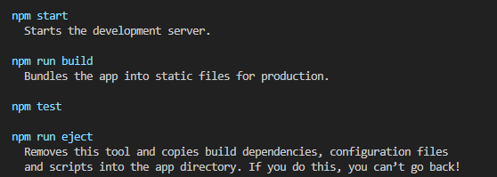
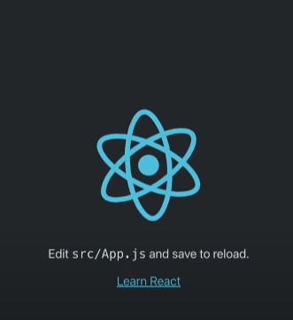
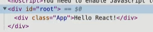
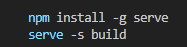

# React 설치

1. node.js를 설치한 뒤 terminal창을 열어 `npx create-react-app 작업할폴더` 를 입력.

2. 여기서 폴더명이 `react`로 되어있다면 오류가 날 수 있으므로 `react-app`과 같은  
   폴더명을 사용해주도록 합니다.

3. 이렇게 설치가 끝이나면 여러가지 폴더들이 생성이 됩니다.

4. 설치가 완료되면
   

    위의 이미지와 같은 명령어들이 터미널창에 출력 되는데

    1. `npm-start` : `npm-start`라는 명령어를 터미널에 치고 엔터를 치면 개발을 할 수 있는 환경이
       구성됩니다.

    2. 아래의 이미지와 같이 port 3000을 이미 사용하고 있는 상태라면 그냥 명령어에 따라 y를 입력해주면 됩니다.
       

    3. 그렇게 완료가 되면 React의 샘플 애플리케이션이 웹에 뜨는 것을 확인할 수 있습니다.

5. 나머지 명령어는 `수정`, `배포` 단계에서 다루겠습니다.

---

# React 수정

설치를 한 후 생성된 기본 파일들을 수정해보도록 하겠습니다.

1. `src`폴더를 보면 `index.js`라는 파일이 있습니다 이 파일이 `입구파일` 입니다.  
   우리가 `npm-start`를 통해 구동을 시키면 `index.js`파일을 찾아 그 파일에 있는 내용대로 동작하게 됩니다.

2. 아래의 이미지와 같은 UI는 `index.js`에 있는 `<App />` 이라는 태그로 인해 생성이 됩니다.
   

3. `App`은 현재폴더에 있는 `App.js`라는 파일로부터 왔고 그 파일은 `index.js`파일에 `import` 되어  
   있기 때문에 `<App />` 이라는 태그로 인해 UI가 생성이 되는 것입니다.

4. `App.js` 파일로 들어가 `App` 함수의 return 밑에 적혀있는 태그로 인해 UI가 생성되고 있음을 확인할 수 있습니다.

5. 내용을 모두 지워준뒤 `div`태그 안에 내용을 적어주면 웹에 그대로 출력하는 것을 확인할 수 있습니다.

6. 그렇기 때문에 실제로 `App.js` 파일에서 내용을 수정하며 앱을 만들어가는 것이라 생각하면 됩니다.

7. `import` 되어 있는 `App.css`로 인해 수정해준 글이 가운데 정렬되는 것을 알 수 있고 `App.css`의 내용을  
   모두 지워주게 되면 pure한 상태로 돌아가는 것을 확인할 수 있습니다.

8. 그리고 파일을 보면 `index.css`도 있는데 해당 파일의 내용도 모두 지워주면 기본적으로 샘플앱에서  
   사용하고 있는 `CSS`스타일은 모두 지워준 것입니다.

9. 아래의 이미지처럼 `App.js`에 적혀있는 `div`태그를 둘러싸고 있는 id가 root인 div태그를 확인할 수 있는데  
   이 태그는 `index.js` 의 코드때문인데 `App`이라는 태그가 id값이 root인 태그로 렌더링 되어라 라는 코드가  
   있으므로 아래와 같은 이미지로 출력이 되는 것입니다.
   

10. 그렇다면 id가 root라는 태그는 어디있을까? `public`이라는 폴더의 `index.html`로 들어가보면  
    id값이 root인 태그를 확인할 수 있습니다.

> 위와 같은 과정을 모두 거치게 되면 샘플앱의 기본적인 스타일은 모두 초기화 됩니다.

---

# 배포

서비스에 효율적인 배포판을 만들기위한 방법을 알아봅시다.

1. 터미널에서 `npm run build`라고 입력하면 `build` 명령어가 시작이 됩니다.  
   여기서 `build`는 배포판을 만들기 위한 과정을 뜻합니다.

2. 그러면 `build`라는 폴더가 생성이 되는데 안의 `index.html` 파일을 열어보면 공백조차없는 것을  
   확인할 수 있는데 배포를 할 땐 공백같은 것이 필요없기 때문에 최대한 용량을 줄인 것이라고 보면 된다.

3. 이제 이 결과물을 실행시켜봅시다. `build` 명령어를 입력하고 나면 아래와 같이 출력이 되는데  
   이는 내가 `build` 한 결과를 서비스 할 때 `serve` 라고하는 앱을 추천을 하고 있습니다.  
   여기서 `serve` 는 웹서버를 뜻하고 거기서 `-s` 라는 옵션을 주게되면 사용자가 어떠한 경로로 들어오던간에  
   `index.html` 파일을 서비스해주게 됩니다. (여기서 `index.html`은 용량을 줄인 결과물입니다.)

    그리고 `build` 라는 폴더를 지정해주게 되면 `build` 안에 있는 `index.html` 파일을 서비스 해주는 것입니다.
    

4. 이를 실행해주기 위해 터미널 창에서 `npx serve -s build` 라고 입력을 해주면 `build` 안에 있는  
   `index.html` 파일을 서비스하는 웹서버가 실행이 되는것입니다.  
    그렇게 실행을 하면 Local 주소가 나오는데 그 주소가 우리가 개발할 환경이 아닌 실제 서비스할 환경을  
    가진 주소입니다.
